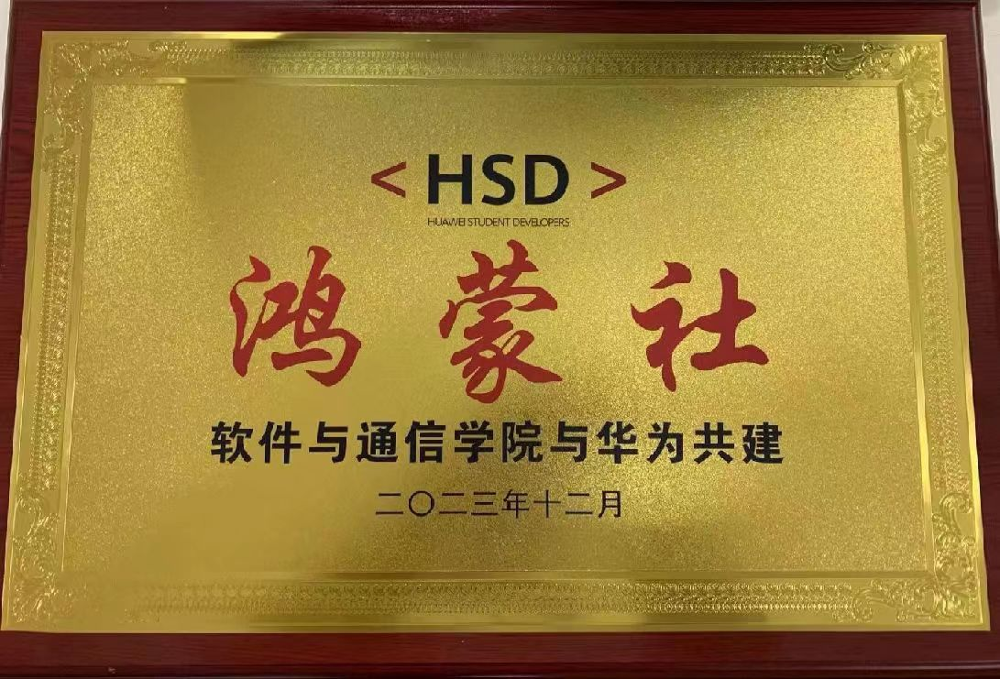

# Introduction

***

📢 This repository is the navigation repository of openharmony club. As an entry point to all repositorys,this repostory provides quick access to technical documents and other repositorys of the community. 
  
🌟 "Openharmony club" is committed to promoting the development of open source technology, providing students with more professional learning opportunities and career development support through the study, practice and promotion of open source technology. Strive to bring more innovation and progress to society and industry in the future.  
  

  

- 🚩 Openharmony club provides a platform for communication, learning and growth through diversified activities. We encourage members to actively participate, share knowledge and experience, and jointly promote the development of open source technologies. Activities include but are not limited to meetup, workshop, outside study and technical training.

- ☘️ Event Details: [For event details, please click](./event/README.md)  

***
  
# Warehouse 

***

📢 This openharmony community has 11 repositorys in total, and the following is the introduction and navigation of each repository.
  
- [Gobang](https://gitee.com/TSGU-OSC/gobang)   This is a Gobang game writen in C + + and EasyX  graphics library.
  
 
- [Best Code Competition](https://gitee.com/TSGU-OSC/BCC)  Tianjin Sino-German University of Applied Technology Open Source Community Best Code PR Competition.
  
- [ffmpeg_learn](https://gitee.com/TSGU-OSC/ffmpeg_learn)  Audio and video codec program ffmpeg command line and development tutorial repository.
  
- [2048Game](https://gitee.com/TSGU-OSC/2048-game)   2048 small game, in the limited space of the composition of larger numbers of games, using C + + and easyx graphics library.
  
- [AiOS](https://gitee.com/TSGU-OSC/ai-os)  Self-writing operating system, records the process of learning operating system from scratch, and the creation process of AIOs.

- [Qt](https://gitee.com/TSGU-OSC/qt) This is a place to share and learn about Qt projects.

- [Open source community](https://gitee.com/TSGU-OSC/Root)    Learn to exchange open source knowledge and help students who are interested in open source culture understand open source.

- [Simple data structure](https://gitee.com/TSGU-OSC/simple-data-structure)  Simple data structures are a repository for the implementation and algorithms of basic data structures.

- [Java_Projects](https://gitee.com/TSGU-OSC/Java_Projects)   Includes some Java language projects and exercises.

- [Community management system](https://gitee.com/TSGU-OSC/management-system)   It is a community management system based on Java and front-end technology.

- [C_C++](https://gitee.com/TSGU-OSC/C_)    This repository is mainly used to store and share our experiences and achievements in C language and C + + programming. Here, we are committed to providing a series of code examples, from basic syntax interpretation to complex project practice, covering the full range of C and C + + learning areas.

***

# Knowledge navigation 

***

😁 The technical documents and basic knowledge in the knowledge navigation repository mainly cover all aspects of the computer field.

In the technical documentation section, you can find in-depth discussions of programming languages such as C, C + +, Java, including syntax, algorithms, best practices, and more. In addition, there are interpretations of various computer science concepts, such as data structures, algorithms, design patterns, and so on.

In the Basics section, you can find configuration guides for various computer environments, including operating systems, development tools, databases, and so on. These materials provide detailed procedures and instructions to help users configure and set up various computer environments.

By reading these technical documents and reviewing the Fundamentals section, you can gain an in-depth understanding of all aspects of the computer world and gain practical programming skills and knowledge of environment configuration. This knowledge and resources will provide important support for your computer learning and development efforts. Here are links to technical documentation and basics:

🌟 [Technical documents please click here](./blog/README.md)

🚀 [Basics click here](./command/README.md)
