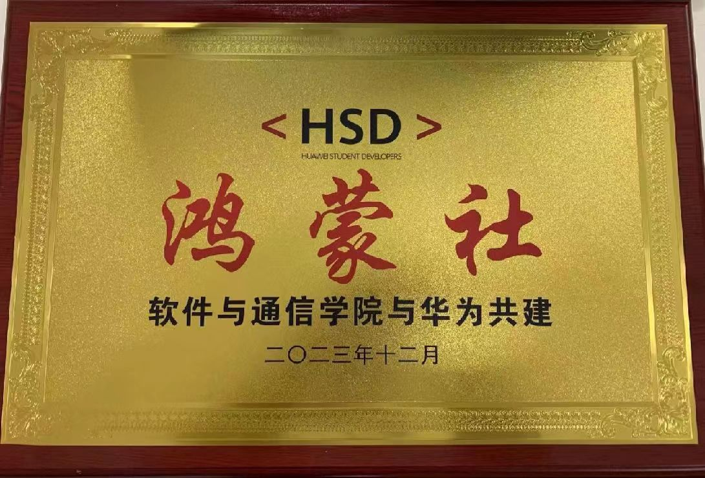

# 介绍  

***

📢 本仓库是开源鸿蒙社的导航仓库。作为所有仓库的入口，本仓库可以快速访问技术文档和社团其他仓库。
  
🌟 “开源鸿蒙社”致力于推动开源技术发展，通过开源技术的学习、实践和推广，为同学们提供更多的专业学习机会和职业发展支持，力争未来为社会和行业带来更多的创新和进步。  
  

  

- 🚩 开源鸿蒙社通过多样化的活动形式，为大家提供一个交流、学习和成长的平台。我们鼓励成员们积极参与，共同分享知识和经验，共同推动开源技术的发展。活动形式包括但不限于meetup、workshop、外出学习和技术培训等

- ☘️ 活动详情: [活动详情请点击](./event/README.md)  

***
  
# 仓库  

***

📢 本开源社团一共有11个仓库，以下是各个仓库的介绍及导航
  
- [Gobang](https://gitee.com/TSGU-OSC/gobang)   这是一个用C++和EasyX图形库写的五子棋游戏。
  
 
- [Best Code Competition](https://gitee.com/TSGU-OSC/BCC)  天津中德应用技术大学开源社团最佳代码PR比赛
  
- [ffmpeg_learn](https://gitee.com/TSGU-OSC/ffmpeg_learn)  音视频编解码程序ffmpeg的命令行及开发教程仓库。
  
- [2048Game](https://gitee.com/TSGU-OSC/2048-game)   2048小游戏，在有限空间内合成更大数字的游戏，使用了c++和easyx图形库。 
  
- [AiOS](https://gitee.com/TSGU-OSC/ai-os)  自写操作系统，记录了从零开始学习操作系统的历程，以及AiOS的创作过程。

- [Qt](https://gitee.com/TSGU-OSC/qt) 这里是一个用于分享和学习Qt项目的地方。  

- [开源社团](https://gitee.com/TSGU-OSC/Root)    学习交流开源知识，帮助对开源文化感兴趣的同学们了解开源。

- [简单数据结构](https://gitee.com/TSGU-OSC/simple-data-structure)  简单数据结构是一个关于基本数据结构的实现和算法的仓库。

- [Java_Projects](https://gitee.com/TSGU-OSC/Java_Projects)   包含了一些Java语言的项目和练习。

- [社团管理系统](https://gitee.com/TSGU-OSC/OSC_main)   是一个基于Java与前端技术实现的一个社团管理系统。

***

# 知识导航  

***

😁 知识导航仓库中的技术文档和基础知识部分主要涵盖了计算机领域的各个方面。

在技术文档部分，您可以找到关于C、C++、Java等编程语言的深入探讨，包括语法、算法、最佳实践等。此外，还有关于各种计算机科学概念的解析，如数据结构、算法、设计模式等。

在基础知识部分，您可以找到关于各种计算机环境的配置指南，包括操作系统、开发工具、数据库等。这些资料提供了详细的步骤和说明，帮助用户顺利配置和设置各种计算机环境。

通过阅读这些技术文档和查阅基础知识部分，您可以深入了解计算机领域的各个方面，掌握实用的编程技能和环境配置知识。这些知识和资源将为您的计算机学习和开发工作提供重要的支持。以下是技术文档和基础知识的链接：

🌟 [技术文档请点击这里](./blog/README.md)

🚀 [基础知识请点击这里](./command/README.md)
