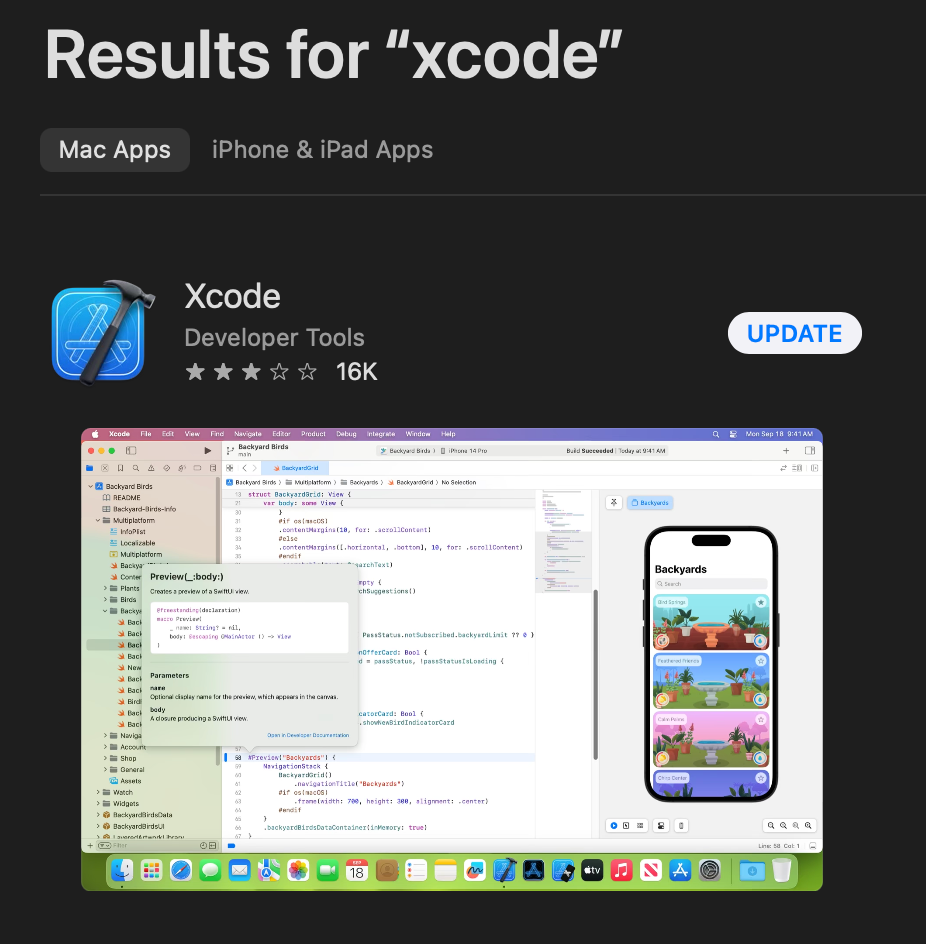
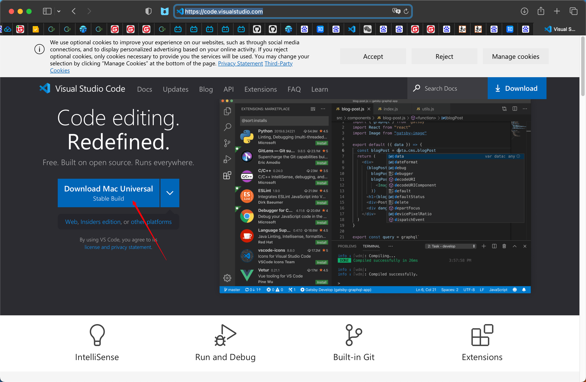
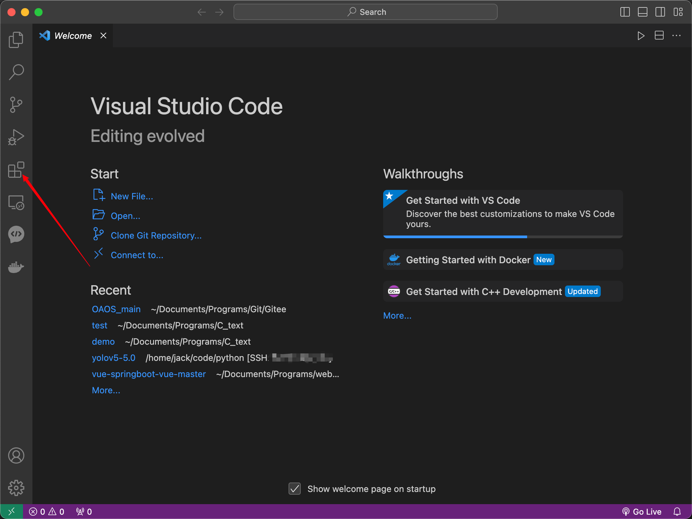
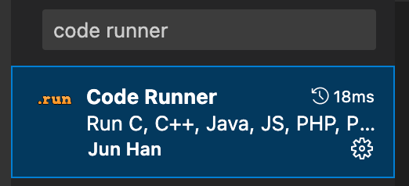
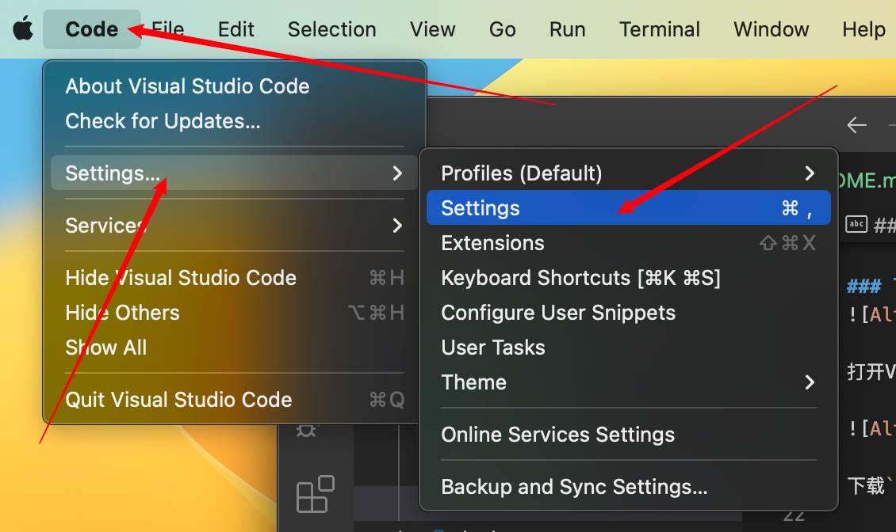
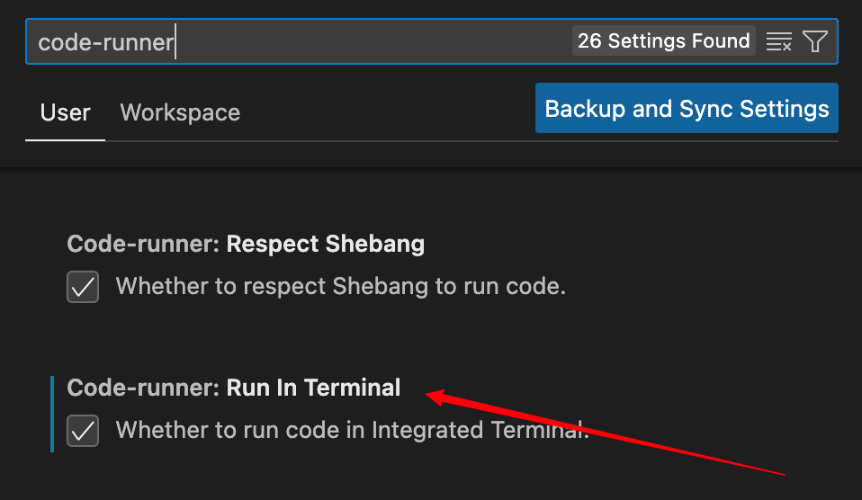
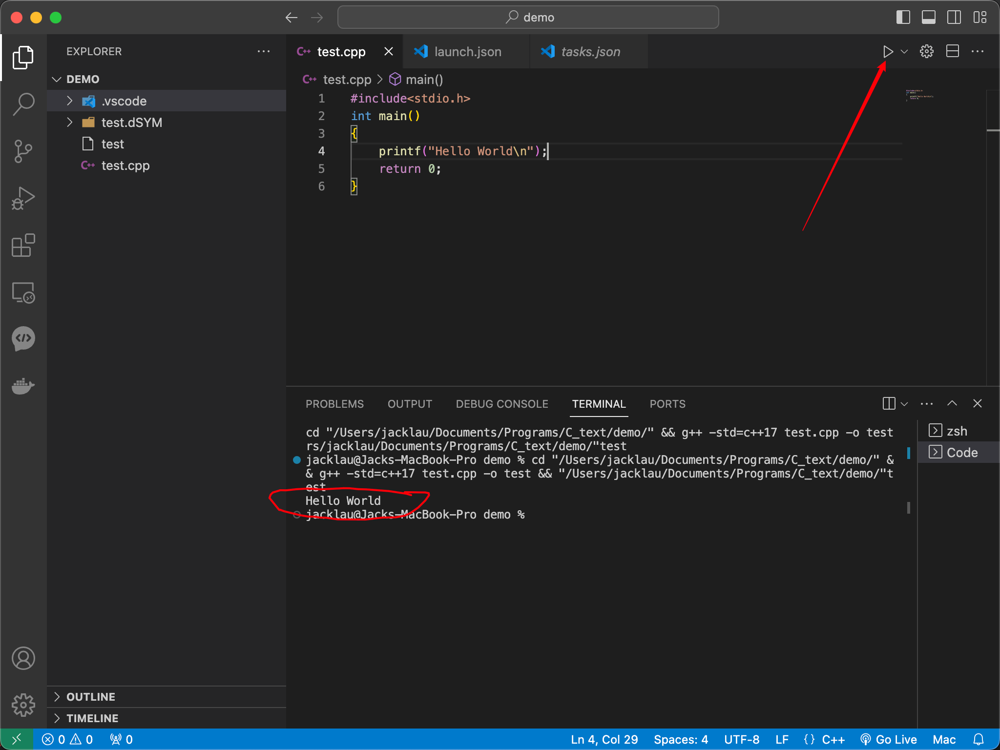

# 配置Viusal Studio Code C/C++开发环境

## Mac

### 下载Xcode
Xcode包含了C++开发的大部分工具，编译器，GDB调试工具等
直接在app store就可以搜索到

下载完成之后 需要在终端里输入一行命令安装命令行工具
```
xcode-select --install
```

### 下载[VS code](https://code.visualstudio.com)


打开VS code 点击插件



下载``code runner``


按照下面操作打开设置面板

搜索code runner 往下翻看 找到RUN IN TERMINAL 一定要选择上


任何选择一个文件夹 新建一个代码文件 写入简单的程序
```c
#include <stdio.h>
int main()
{
    printf("hello world\n");
    return 0;
}
```
点击右上角的run code 就可以运行程序了 如图 运行的信息都会在下面的terminal里


### 配置调试环境