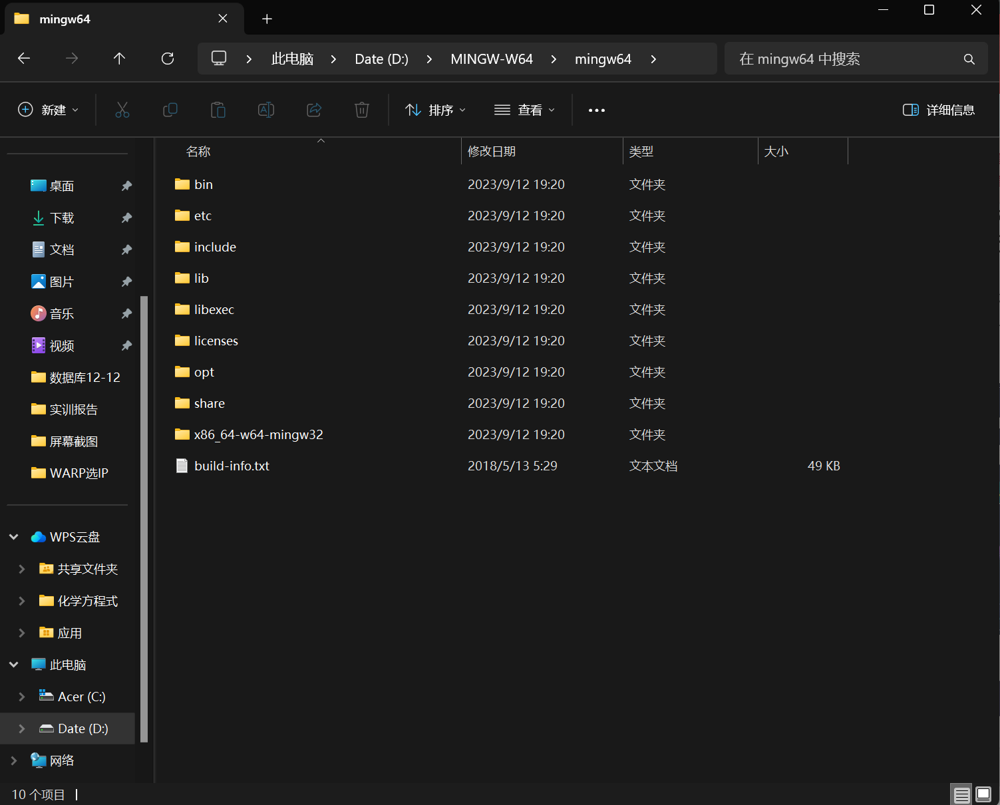
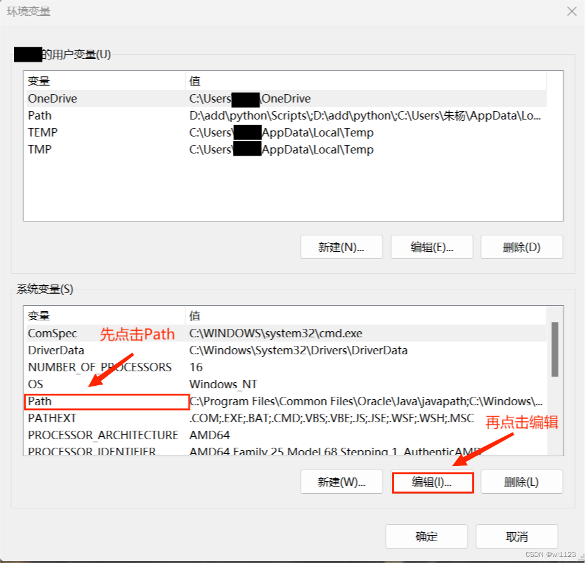
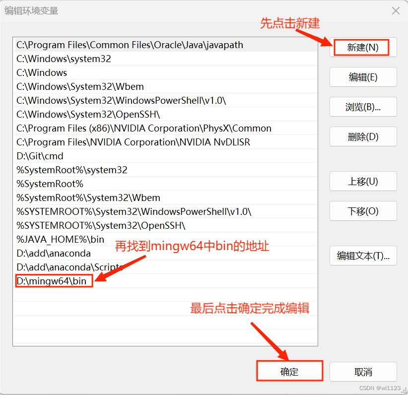
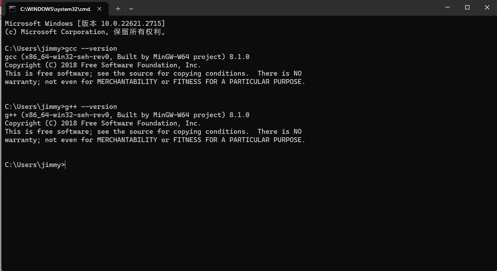
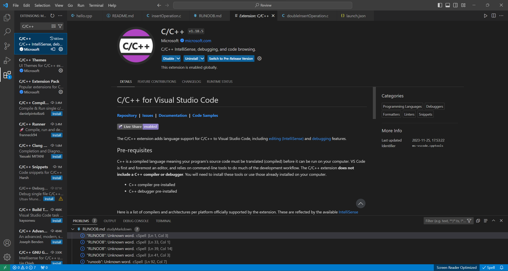
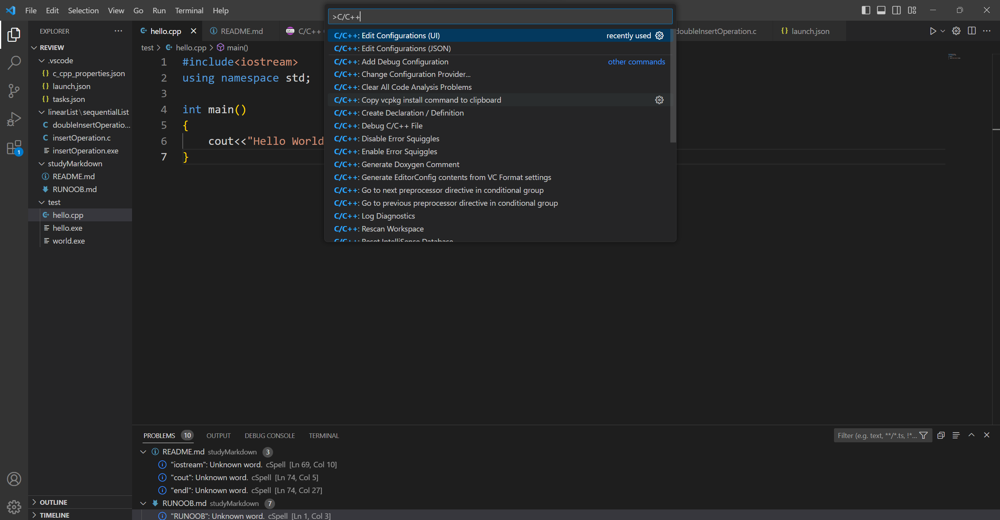
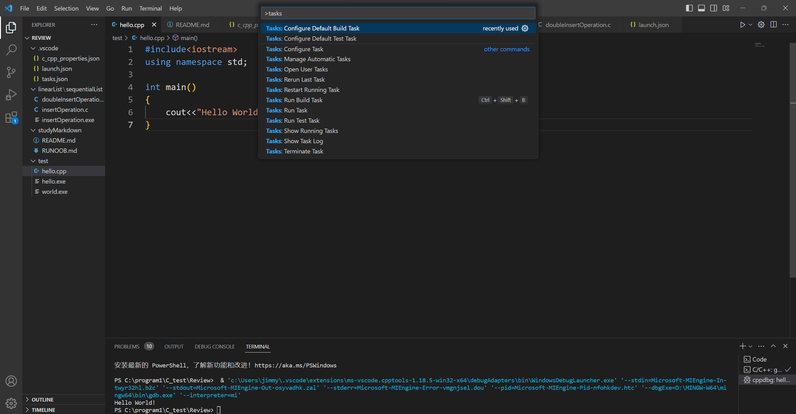
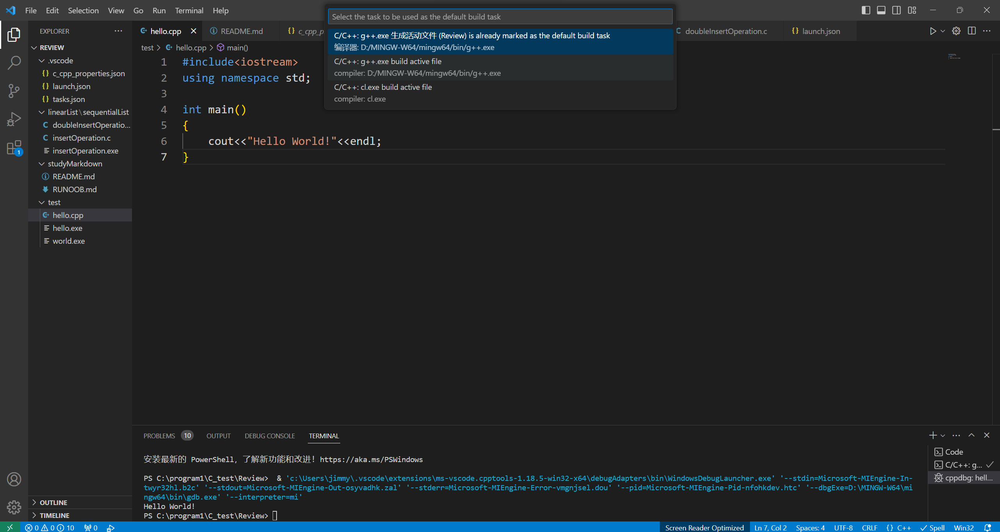
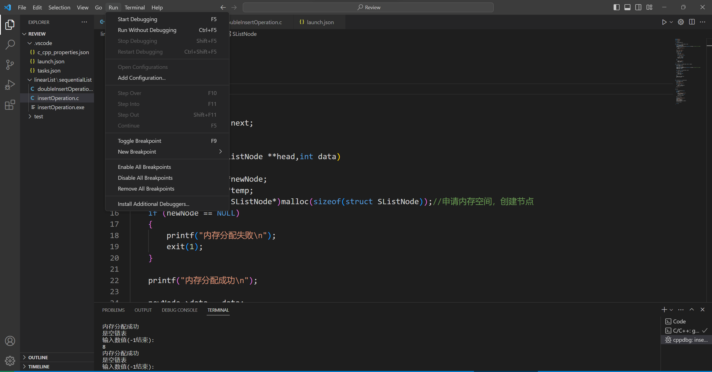
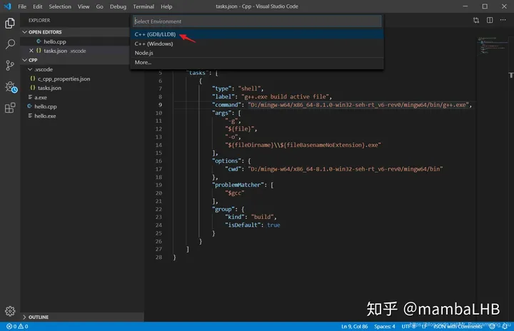

# Windows配置VSCode的C/C++环境

## 一、下载

在官网下载VSCode，官网：https://code.visualstudio.com/

## 二、安装

直接打开下载好的.exe文件进行安装即可，选择一个没有中文和空格的路径就行，选择添加任务时全选。

## 三、配置C/C++环境

### 1. 安装MinGW编译器

1. 点击链接进入MingGw官网

- https://sourceforge.net/projects/mingw-w64/files/

- 进入官网后向下翻
- 会见到以下画面


下载完成后会得到一个压缩包,解压后将其中的mingw64文件夹拷贝至硬盘根目录
（我移入的是D盘，所以我的mingw64文件夹地址为：D:\MINGW-W64\mingw64）
如下图所示


### 2.编辑环境变量

打开设置搜索环境变量
选择编辑系统环境变量会弹出以下界面





这里的地址为所存mingw64中bin目录的地址如图


### 3.检验并下载C/C++插件

在以上操作完成后我们可以点击win+R输入cmd打开命令面板并分别输入以下指令

```
gcc --version
```
    
```
g++ --version
```

若出现如下图所示则成功



然后打开VSCode进行如下操作

点击拓展然后搜索C/C++安装如图所示插件



需要一段时间，请静心等待，等右下角的提示消失了，说明安装成功

此时需要下载此插件的旧版本，点击插件的设置图标然后点击Install Another Version


随后向下滑动选择1.8.4版本


此时最好重启VSCode让扩展生效。

重启之后打开已经在磁盘创建好的文件夹可通过菜单栏的File-->Open Folder打开

然后可创建一个hello.cpp文件（右键点击New File）
```C++
#include<iostream>
using namespace std;

int main()
{
    cout<<"Hello World!"<<endl;
}
```

### 4.配置C/C++环境

1. 配置编译器

接下来配置编译器路径，按快捷键Ctrl+Shift+P调出命令面板，输入C/C++，选择“Edit Configurations(UI)”进入配置。这里配置两个选项： - 编译器路径：D:/MINGW-W64/mingw64/bin/g++.exe

> 这里的路径根据大家自己安装的Mingw编译器位置和配置的环境变量位置所决定。

* IntelliSense 模式：gcc-x64




配置完成后，此时在侧边栏可以发现多了一个.vscode文件夹，并且里面有一个c_cpp_properties.json文件，内容如下，说明上述配置成功。

```
    {
    "configurations": [
        {
            "name": "Win32",
            "includePath": [
                "${workspaceFolder}/**"
            ],
            "defines": [
                "_DEBUG",
                "UNICODE",
                "_UNICODE"
            ],
            "windowsSdkVersion": "10.0.22621.0",
            "compilerPath": "D:/MINGW-W64/mingw64/bin/g++.exe",
            "cStandard": "c17",
            "cppStandard": "c++17",
            "intelliSenseMode": "gcc-x64"
        }
    ],
    "version": 4
}
```

2. 配置构建任务

接下来，创建一个tasks.json文件来告诉VS Code如何构建（编译）程序。该任务将调用g++编译器基于源代码创建可执行文件。 按快捷键Ctrl+Shift+P调出命令面板，输入tasks，选择“Tasks:Configure Default Build Task”：



再选择“C/C++: g++.exe build active file”：



此时会出现一个名为tasks.json的配置文件，内容如下：

```
{
	"version": "2.0.0",
	"tasks": [
		{
			"type": "cppbuild",
			"label": "C/C++: g++.exe 生成活动文件",
			"command": "D:/MINGW-W64/mingw64/bin/g++.exe",
			"args": [
				"-fdiagnostics-color=always",
				"-g",
				"${file}",
				"-o",
				"${fileDirname}\\${fileBasenameNoExtension}.exe"
			],
			"options": {
				"cwd": "D:/MINGW-W64/mingw64/bin"
			},
			"problemMatcher": [
				"$gcc"
			],
			"group": {
				"kind": "build",
				"isDefault": true
			},
			"detail": "编译器: D:/MINGW-W64/mingw64/bin/g++.exe"
		}
	]
}
```

3. 配置调试设置

这里主要是为了在.vscode文件夹中产生一个launch.json文件，用来配置调试的相关信息。点击菜单栏的Run-->Start Debugging：



选择C++(GDB/LLDB)：



如果没有自动生成launch.json文件则点击这里如图所示：


如果自动生成则不用管

紧接着会产生一个launch.json的文件：

```
{
    // Use IntelliSense to learn about possible attributes.
    // Hover to view descriptions of existing attributes.
    // For more information, visit: https://go.microsoft.com/fwlink/?linkid=830387
    "version": "0.2.0",
    "configurations": [
        {
            "name": "g++.exe - Build and debug active file",
            "type": "cppdbg",
            "request": "launch",
            "program": "${fileDirname}\\${fileBasenameNoExtension}.exe",
            "args": [],
            "stopAtEntry": false,
            "cwd": "D:/MINGW-W64/mingw64/bin",
            "environment": [],
            "externalConsole": False,
            "MIMode": "gdb",
            "miDebuggerPath": "D:\\MINGW-W64\\mingw64\\bin\\gdb.exe",
            "setupCommands": [
                {
                    "description": "Enable pretty-printing for gdb",
                    "text": "-enable-pretty-printing",
                    "ignoreFailures": true
                },
                {
                    "description": "Set Disassembly Flavor to Intel",
                    "text": "-gdb-set disassembly-flavor intel",
                    "ignoreFailures": true
                }
            ],
            "preLaunchTask": "C/C++: g++.exe 生成活动文件"
        }
    ]
}
```

如果想输出到控制台则将"externalConsole": 后改为true

以后在程序的`return 0`前加上`getchar()`

