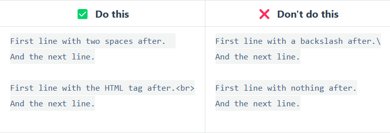
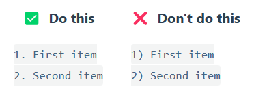
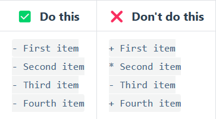
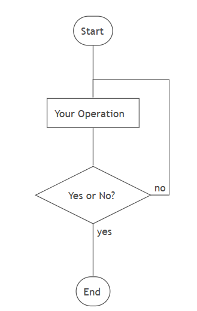
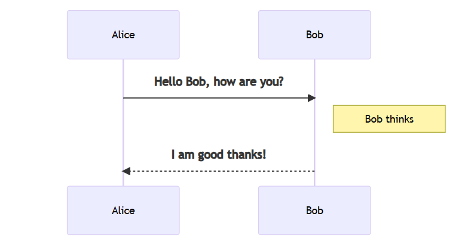

# Markdown

## 介绍

- ### 简介

  - Markdown是一种轻量级标记语言，它允许人们使用易读易写的纯文本格式编写文档。

  - 然后转换成有效的XHTML（或者HTML）文档，同时可以与HTML混编。

  - 支持导出为HTML、PDF等格式的文件。

  - 被大量应用于网络平台的写作，如Github、Gitee、Wikipedia（维基百科）等常用的网站中，以及各类技术网站、个人博客、网络教育、内容管理系统等。

    

  - 官方文档：[Markdown 基本语法 | Markdown 官方教程](https://markdown.com.cn/basic-syntax/)

  

- ### 发展历史

  - Markdown由<u>John Gruber</u>在2004年创造。在语法上有很大一部分是跟<u>亚伦·斯沃茨（Aaron Swartz）</u>共同合作的

  - John Gruber是一位网络作家、软件工程师和UI设计师，他在写作时发现传统的网页语言过于繁琐，影响了写作的效率和乐趣。于是他创造了Markdown，希望通过这种新型的标记语言，使文本编辑变得简单明了。

  - 但是刚刚诞生的Markdown和现在的markdown有很多不同之处：

    - **语法拓展**：原生的Markdown语法支持的元素相对有限，例如不支持表格。而现在的Markdown，特别是各种衍生版本如GitHub Flavored Markdown（GFM），**<u>增加了对表格、围栏式代码块、任务列表等的支持</u>**，这些功能大大增强了Markdown的实用性和灵活性。

    - **编辑器发展**：最初的Markdown使用者主要依赖于纯文本编辑器进行文档编写。随着技术的发展，现在市面上出现了许多专门针对Markdown编辑的应用程序，如**<u>Typora、VS Code</u>**等，这些工具不仅提供了丰富的编辑功能，还支持实时预览，极大地提升了用户的写作体验。

    - **平台集成**：Markdown最初主要被技术写作者和程序员使用。但现在，它已经**<u>成为许多内容创作平台和学习平台的</u>**标准或可选**编辑工具**，如GitHub、WordPress、Hugo等，这些平台的集成使得Markdown的应用范围大大扩展。

    - **社区生态**：Markdown的社区生态也发生了巨大变化。现在，有许多在线平台和社区专门为Markdown用户提供支持和资源，包括教程、插件、主题开发等，这些资源的丰富性为Markdown的发展提供了强有力的支持。

    - **语法标准化**：虽然原生Markdown语法相对简单，但随着各种“方言”的出现，也带来了一定的混乱。现在，尽管仍然存在多种衍生语法，社区也在努力推动一些**<u>标准化</u>**的努力，以减少混淆并**<u>提高兼容性</u>**。

    - **兼容性适应性**：原生的Markdown就具有良好的HTML兼容性，这一点在现代的Markdown编辑器中得到了保留和扩展。现代编辑器不仅<u>支持直接导出为HTML</u>，还支持**<u>导出为PDF等多种格式</u>**，使得文档的分享和发布更加方便。

    - **可访问性**：随着Markdown的普及，越来越多的工具和平台开始关注Markdown文档的可访问性，例如通过**<u>支持自定义CSS和JavaScript</u>**来改善视觉障碍用户的阅读体验。

    - **教育领域应用**：Markdown因其简洁性逐渐**<u>成为教育领域的教学和学习工具</u>**。教师和学生利用Markdown整理和分享知识，促进了学术信息的共享和传播。

  - **总结**：自诞生以来，Markdown凭借其简洁性和灵活性迅速获得了广泛的认可和应用，成为了网络写作和文档编辑的重要工具。

    

- ### 主要特点

  - **简洁性**：Markdown的语法设计非常直观，学习曲线平缓，用户可以在短时间内掌握基本的文档编辑技巧。

  - **可读性**：即使不经过转换，Markdown格式的文本也能保持良好的可读性，这得益于其清晰的标记规则和纯文本的特性。

  - **转换灵活性**：Markdown文档可以轻松转换为多种格式，包括但不限于HTML、PDF，这一特性使得它能够在不同平台和设备上无缝展示，极大地增强了文档的兼容性和适用性。

    

- ### Markdown的优势与局限性

  - #### 优势

    - **易于学习使用**：基础语法简单，用户无需专业知识即可快速上手。
  
    - **兼容性强**：广泛适用于不同的平台和设备，无论是Windows、macOS还是Linux，都有对应的编辑器支持Markdown。

    - **格式转换灵活**：轻松转换为HTML、PDF等格式，方便分享和发布，这对于需要在不同平台发布内容的内容创作者来说尤其重要。

  
  - #### 局限性
  
    - **功能有限**：对于复杂格式和高级排版，Markdown的支持不如专业的文档处理软件，如Word或LaTeX。
    
      > 关于LaTeX
      >
      > > 了解：
      > >
      > > [LaTeX：什么是LaTeX? - 知乎 (zhihu.com)](https://zhuanlan.zhihu.com/p/349047279)
      >
      > > 学习：
      > >
      > > [LaTeX 入门 - OI Wiki (oi-wiki.org)](https://oi-wiki.org/tools/latex/)
      > >
      > > [论文写作利器---LaTeX教程（入门篇）（更新中）_sci tex通用模板-CSDN博客](https://blog.csdn.net/brave_stone/article/details/88913010)
      >
      > > 官网：
      > >
      > > https://www.latex-project.org/
    
    
      - **图像和表格处理**：在一些编辑器中，图像和表格的处理可能不够直观，需要用户有一定的耐心和技巧。
    
    
      - **依赖第三方工具**：虽然有许多优秀的Markdown编辑器，但用户在选择和使用这些工具时可能需要花费额外的时间和精力。
    
        
  

## 支持软件的介绍、下载与安装

- ### 支持软件

  - 常见的软件，比如Vscode、typora、obsidian等；

  - 另外还有：

    - Mark Text

      - 它并没有采用普遍的双栏模式，而是使用了和 Typora 一样的“所见即所得”‘
      - 支持 [CommonMark Spec](https://sspai.com/link?target=https%3A%2F%2Fspec.commonmark.org%2F0.29%2F) 和 [GitHub Flavored Markdown Spec](https://sspai.com/link?target=https%3A%2F%2Fgithub.github.com%2Fgfm%2F) 这两个 Markdown 扩展、数学表达式（KaTeX）、front matter 和 emoji。它还有各种预设主题，以后还会开放自己导入主题的功能。
    
      
    
      - 官方网站链接：[https://marktext.app/](https://sspai.com/link?target=https%3A%2F%2Fmarktext.app%2F)
    
        
    
    - VNote
      - VNote 使用 C++ 开发，基于 Qt 5.9。它号称是更懂程序员和 Markdown 的笔记软件，虽然看上去并不十分美观，但它的功能很强大。它有 **Vim** 模式和一系列强大的快捷键、可以直接从剪切板插入图片、支持 [Mermaid](https://sspai.com/link?target=http%3A%2F%2Fknsv.github.io%2Fmermaid%2F)、 [Flowchart.js](https://sspai.com/link?target=http%3A%2F%2Fflowchart.js.org%2F)、 [MathJax](https://sspai.com/link?target=https%3A%2F%2Fwww.mathjax.org%2F)、 [PlantUML](https://sspai.com/link?target=http%3A%2F%2Fplantuml.com%2F) 和 [Graphviz](https://sspai.com/link?target=http%3A%2F%2Fwww.graphviz.org%2F)、强大的原地预览（图片、图表、公式）等功能，是一个很懂程序员的强大 Markdown 编辑器。
      
        
      
      - 链接：[https://tamlok.github.io/vnote](https://sspai.com/link?target=https%3A%2F%2Ftamlok.github.io%2Fvnote)；
      
        
      
    - 思源笔记
      - 一款隐私优先、自托管且完全开源的个人知识管理系统，使用 typescript 和 golang 编写。
      
      - 思源笔记是一款 Markdown 块级引用和双向链接的开源且跨平台的云笔记和网状笔记应用，支持 Windows、Mac 和 Linux，可在浏览器上直接使用，支持移动端适配。
      
        
      
      - 链接：[思源笔记 - 隐私优先的个人知识管理系统，支持 Markdown 排版、块级引用和双向链接 (b3log.org)](https://b3log.org/siyuan/)
      
        

- ### 支持软件下载

  - Typora：[Typora 官方中文站 (typoraio.cn)](https://typoraio.cn/)

  - Obsidian：[Obsidian - Sharpen your thinking](https://obsidian.md/)
    - 中文论坛下载地址：[Thoughts (teambition.com)](https://thoughts.teambition.com/share/62a131711a6baa00416a79d3#title=Obsidian_安装包)
    - 中文论坛使用指南：[obsidian新手不完全指南 - 经验分享 - Obsidian 中文论坛](https://forum-zh.obsidian.md/t/topic/1628)

  - Vscode：[Visual Studio Code - Code Editing. Redefined](https://code.visualstudio.com/)

  - 其他的请自行搜索下载安装
  
    

## 配置编写环境

  - 配置文件选项：
    - 启动选项
    - 大纲
    - 保存和恢复
    
  - 编辑器：
    - 缩进
    - 成对符号
    - 拼写检查
    
  - Markdown
    - 语法偏好
    - 拓展语法
    - 代码块
    
  - 外观
    - 窗口样式
    - 主题（可单独调整）
    - 主题自定义
    
  - 通用
    - typora服务器
    
      
    

## 语法讲解

- ### 基本语法

- 官方文档[Markdown 基本语法 | Markdown 官方教程](https://markdown.com.cn/basic-syntax/)

   - #### 标题语法

     **语法：**
     
     ```
     # 第一级标签		
     ## 第二级标签
     ### 第三级标签
     #### 第四级标签
     ##### 第五级标签
     ###### 第六级标签
     ```

       

     **效果：** *（技术文档展示时会出现些许问题，且同样无法展示图片，故采用转义字符展示）*

     \# 第一级标签

     \## 第二级标签

     \### 第三级标签
     
     \#### 第四级标签
     
     \##### 第五级标签
     
     \###### 第六级标签
     
       
     
     **快捷键:**
     
     一级标题: Ctrl + 1
     
     二级标题: Ctrl + 2
     
     三级标题: Ctrl + 3
     
     四级标题: Ctrl + 4
     
     五级标题: Ctrl + 5
     
     六级标题: Ctrl + 6
     
       
     
     **注意点：**
     
     > 不同的 Markdown 应用程序处理 `#` 和标题之间的空格方式并不一致。为了兼容考虑，请用一个空格在 `#` 和标题之间进行分隔。
     >
     > 	
     
     *在官方文档中另外有一可选语法，想要了解的同学请搜索官方文档查看*
   
   
   
   
   
   
      - #### 段落语法
   
        **语法：**
   
        ```
        直接编写文档即可，基本没有特定格式和语法限制
        ```
   
        
   
        **效果：**
   
        直接编写文档既可，基本没有特定格式和语法限制
   
        
   
        **注意点：**
   
        > 不要用空格（spaces）或制表符（ tabs）缩进段落。
        >
        > 
   
        
   
        
   
   
   
   - #### 换行语法
   
        **语法**：
   
        ```
          文段(空格)(空格)... [Enter回车]
          文段(空格)(空格)... [Enter回车]
          
          或者
          
          文段
          [Enter回车]
          文段
          ......
        ```
   
        
   
        
   
        **效果：**
   
        ​	文档  
   
        ​	文档  
   
        ​	（打开源代码模式可以看到`文档`后面有`↓`，即是换行）
   
        ---
   
        
   
        ​	文档
   
        ​	文档
   
        ​	（这个不是语法，只是在两段文字中间回车换行表示开启一个新的段落）
   
        
        
        
        
        **注意点：**
        
        > 几乎每个 Markdown 应用程序都支持两个或多个空格进行换行，称为 `结尾空格（trailing whitespace)` 的方式，但这是有争议的，因为很难在编辑器中直接看到空格，并且很多人在每个句子后面都会有意或无意地添加两个空格。由于这个原因，你可能要使用除结尾空格以外的其它方式来换行。幸运的是，几乎每个 Markdown 应用程序都支持另一种换行方式：HTML 的 `<br>` 标签。
        >
        > 为了兼容性，请在行尾添加“结尾空格”或 HTML 的 `<br>` 标签来实现换行。
        >
        > 还有两种其他方式我并不推荐使用。CommonMark 和其它几种轻量级标记语言支持在行尾添加反斜杠 (`\`) 的方式实现换行，但是并非所有 Markdown 应用程序都支持此种方式，因此从兼容性的角度来看，不推荐使用。并且至少有两种轻量级标记语言支持无须在行尾添加任何内容，只须键入回车键（`return`）即可实现换行。
        >
        >       
        
   - #### 强调语法
   
        **语法：**
   
        - 粗体(Bold)
   
          ```
          **文段1**
          __文段2__
          ```
   
        - 斜体(Italic)
   
          ```
          *文段1*
          _文段2_
          ```
   
        - 下划线(underline)
   
          ```
          Markdown没有实现下划线的语法，是直接引用HTML的<u></u>来实现的。
          一般使用快捷键进行编写。
          在一些文章中提及不建议使用下划线，因为会和链接的样式类似，容易误解。
          ```
   
        - 高亮(highlight)
   
          ```
          ==文段==(不同主题或者不同编辑器，高亮的背景颜色可能会不一样)
          ```
   
        - 粗体 + 斜体混合使用
   
          **上述四种引用方式均可混用，在这里只展示粗体和斜体**
   
          ```
          示例：
          Markdown是一种**轻量级*标记*语言**，排版语法简洁，让人们更多地**关注*内容本身*而非排版**。// 粗体包含斜体
          Markdown是一种*轻量级**标记**语言*，排版语法简洁，让人们更多地*关注**内容本身**而非排版*。// 斜体包含粗体
          Markdown是一种__轻量级_标记_语言__，排版语法简洁，让人们更多地__关注_内容本身_而非排版__。// 粗体包含斜体
          Markdown是一种_轻量级__标记__语言_，排版语法简洁，让人们更多地_关注__内容本身__而非排版_。// 斜体包含粗体
          
          Markdown是一种***轻量级标记语言***，排版语法简洁，让人们更多地***关注内容本身而非排版***。// 粗体 + 斜体
          Markdown是一种___轻量级标记语言___，排版语法简洁，让人们更多地___关注内容本身而非排版___。// 粗体 + 斜体
          ```
   
   **效果：**
   
   - 粗体：
   
       **文段1**
   
       __文段2__
   
   
   - 斜体：
   
       *文段1*
   
       _文段2_
       
   - 下划线：
   
       <u>文段</u>
   
   
   - 高亮：
   
       ==文段==（不同`主题`或者不同`编辑器`，高亮的颜色会不同）
   
       *gitee没有正常展示，在编辑器中是有效果的，可以下载下来进行查看*
   
   
   - 粗体 + 斜体 混合使用：
   
       Markdown是一种**轻量级*标记*语言**，排版语法简洁，让人们更多地**关注*内容本身*而非排版**。
   
       // 粗体包含斜体
       
       
       
       Markdown是一种*轻量级**标记**语言*，排版语法简洁，让人们更多地*关注**内容本身**而非排版**。
       
       // 斜体包含粗体
       
       
       
       Markdown是一种***轻量级标记语言***，排版语法简洁，让人们更多地***关注内容本身而非排版***。
       
       // 斜体 + 粗体
       
       
   
   **快捷键：**
   
   - 粗体：Ctrl + B
   - 斜体：Ctrl + I
   - 下划线：Ctrl + U
   - 高亮默认没有快捷键，有需要的可以查询如何设置；
   
   
   
   **注意点：**
   
   - 粗体：
   
     > Markdown 应用程序在如何处理单词或短语中间的下划线上并不一致。为兼容考虑，在单词或短语中间部分加粗的话，请使用星号（asterisks）。
     >
     > 
     
     
     
     
   
   
   - #### 引用语法
   
      **语法：**
   
      - ##### 单个段落的块引用
   
        ```
        > 文段
        ```
   
      - ##### 多个段落的块引用
   
        ```
        > 文段1
        >
        > 文段2
        ```
   
      - ##### 嵌套块引用
   
        ```
        > 文段1
        >
        >> 文段2
        ```
   
      - ##### 其他元素的块引用
   
        ```
        > #### It's not whether you get knocked down, it's whether you get up.
        >
        > - Your attitude, not your aptitude, will determine your 	 altitude.
        > - What you do today can improve all your tomorrows.
        >
        > *It always* seems impossible until it's done.
        ```
   
   
   
   
   - **效果：**
   
      - 用法一：
   
        > 文段
   
      - 用法二：
   
        > 文段1
        >
        > > 文段2
   
      - 用法三：*（技术文档展示时会出现些许问题，且同样无法展示图片，故采用转义符展示）*
   
        >/#### It's not whether you get knocked down, it's whether you get up.
      	>
        >- Your attitude, not your aptitude, will determine youraltitude.
        >- What you do today can improve all your tomorrows.
        >
        >*It always* seems impossible until it's done.
   
   
   
   
   
   
   - #### 列表语法
   
      **语法**
   
      - ##### 有序列表
   
        - 写法一
   
          ```
          1.（空格）2.（空格）3.（空格）...
          或者
          1.（空格）[Enter回车]
          2.（空格）[Enter回车]
          3....
          // 第二种按回车键自动生
          ```
   
        - 写法二
   
          ```
          // 同上，不再赘述
          1. 1. 1...
          或者
          1.
          1.
          1.
          ...
          ```
        
      - ##### 无序列表
      
        - 标准
          ```
            三种符号均可：
            -（短横线 / 破折号）（空格）文段1
            
            +（加号）（空格）文段2
            
            *（星号）（空格）文段3
          ```
        
        - 在表格中嵌套其他语法
        
             - 段落
        
               ```
               - 文段1
               - 文段2
               [四个空格或者一个制表符]文段3
               - 文段4
               ```
        
             - 引用块
        
               ```
               - 文段1
               - 文段2
               [同上]> 文段3
               - 文段4
               ```
        
             - 代码块
        
               ```
               - 文段1
               - 文段2
               [缩进八个空格或者两个制表符]
               		<head>
               			<title>Test</title>
               		</head>
               - 文段4
               ```
        
             - 图片
        
               ```
               - 文段1
               - 文段2
               	
               	// 
               - 文段4
               ```
        
             - 列表
        
               ```
               1. 文段1
               2. 文段2
               	- 内容1
               	- 内容2
               3. 文段4   
               ```
        
      
      **效果：**
      
         - 有序列表：
      
            1. 文段1
            2. 文段2
            3. 文段3  
      
      
         - 无序列表
      
              - 文段1
              - 文段2
              - 文段3
      
         - 在表格中嵌套其他语法：
      
           - 段落
      
             1. 文段1
      
             2. 文段2
      
                内容1
      
                内容2
      
             3. 文段3 
      
             
      
           - 引用块
      
                - 文段1
      
                - 文段2
      
                  > 文段3
      
                - 文段4
      
             
      
           - 代码块
      
                - 文段1
      
                - 文段2
      
                     <head>
                         <title>Test</title>
                     </head>
      
                - 文段4
      
             
      
           - 图片
      
                - 文段1
      
                - 文段2
                  
                  
                  
                - 文段4
           
             
           
           - 列表
           
                   1. 文段1
                   2. 文段2
                   
                   - 内容1
                   
                   - 内容2
                   3. 文段
      
      **快捷键：**
      
      - 有序列表：Ctrl + Shift + [
      - 无序列表：Ctrl + Shift + ]
      
      **注意点：**
      
      - 有序列表
      
          > CommonMark和其他一些轻量级标记语言允许您使用括号 (`)`) 作为分隔符（例如，`1）第一项`），但并非所有Markdown应用程序都支持这一点，因此从兼容性的角度来看，这不是一个很好的选择。所以为了兼容性考虑，请您使用英文句点。
          >
          > **// 原文档没有翻译，使用了机翻，逻辑与表达上可能存在某些问题** 
          >
          > 
      
      - 无序列表
      
        > Markdown应用程序不支持如何处理同一列表中的不同分隔符。所以为了兼容性，请不要在同一个列表中混合和匹配分隔符——选择一个并一直使用下去。
        >
        > **// 原文档没有翻译，使用了机翻，逻辑与表达上可能存在某些问题** 
        >
        > 
   
   
   
   
   
   
   - #### 代码语法
   
      **语法：**
   
      - 用法一
   
           想要将一个单词或者短语表示为代码：使用反引号(`` `)包裹它们。
      
           ```
           Success is not `final`, failure is not `fatal`: It is `the courage to continue that counts`.
           ```
   
      - 用法二
      
        想要表示为代码的单词或者短语中包含一个或者多个反引号：使用双反引号(` `` `)包裹它们。
   
        ```
        `` Success is not `how high you have climbed`, but how you `make a positive difference to the world.` `` 
        ```
      
      - 用法三
      
        代码块
        
        ```
        // 想要创建一个代码块，请将代码块的每一行缩进**至少四个空格**或者**一个制表符**
        Every adversity, every failure, every heartache carries with it the seed of an equal or greater benefit.
        The road to success and the road to failure are almost exactly the same.
           	<html>
           		<head>
           		</head>
           	</html>
        ```
        
        *NOTE：如果要创建不用缩进的代码块，请使用 `围栏式代码块 `*
   
      
      
      **效果：**
   
         - 用法一：
      
           Success is not `final`, failure is not `fatal`: It is `the courage to continue that counts`.
           
         - 用法二：
   
           `` Success is not `how high you have climbed`, but how you `make a positive difference to the world.` ``
           
         - 用法三：
   
           <html>
   
           	<head>
           	    <title>Test</title>
           	</head>
      
           <html>
      
           // 中间的为代码块，区别于围栏式代码
   
   
   
   
   
   
   - #### 分割线语法
   
      **语法：**
   
      ```
      三种符号均可：
      第一种：***（星号）
      
      第二种：---（短横线 / 破折号）
         
      第三种：___（下划线）// 三条下划线
      ```
   
      **效果：**
   
      - 第一种：***
   
        ***
      
      
      - 第二种：---
      
           ---
      
      
      - 第三种：___
      
           ___
      
           
      
      **注意点：**
      
         > 为了兼容性，请在分隔线的前后均添加空白行。
         >
         > 
      
   
   
   
   
   
   
   - #### 链接语法
   
      **语法：**
   
      - 第一种
   
        ```
        [超链接显示名](超链接地址)
        ```
   
      - 第二种
   
        当鼠标悬停在链接上时会出现的文字
      
        ```
         [超链接显示名](超链接地址 (空格) "超链接Title")
        ```
   
       - 第三种
      
         直接显示网址和Email地址
      
         ```
         // 尖括号包裹
         <https://markdown.com.cn>
          <Test@example.com>
         ```
      
       - 第四种：强调链接
   
         ```
          We can learn the basic grammer in **[markdown基本语法](https://markdown.com.cn/intro.html)**
         ```
   
         *第五种：引用类型链接：内容过多，不再赘述这一小点*
   
      
   
      **效果：**
      
      - 第一种：
      
           [网站名称](网站地址)
      
      
         - 第二种：
      
              [网站名称](网站地址 "这是该网站的Title")
      
      
         - 第三种：
      
            <https://markdown.com.cn>
      
           <Test@example.com>
      
      
         - 第四种：
      
            We can learn the basic grammer in **[markdown基本语法](https://markdown.com.cn/intro.html**
      
   
   
   
   
   
   
   
   - #### 图片语法
   
      **语法：**
   
      - 用法一
   
        标准使用方法
        
        ```
         
        // 图片的Title与链接Title相同，都是在鼠标悬停在其上是显示Title
        ```
        
      - 用法二
      
        为图片添加链接，点击图片跳转至对应网页
        
        ```
        [](点击图片跳转的网址)
        ```
      
      **效果：**
      
         - 第一种：
      
           
      
      
         - 第二种：
      
           [](https://markdown.com.cn/)
      
           ==需要按住`Crtl`，并且点击图片，才能跳转网页==
      
      **快捷键：**
      
         - 插入图片：Crtl + Shift + I  
      
   
   
   
   
   
   
   - #### 转义字符语法
   
      **语法：显示本需要格式化 Markdown 文档的字符**,即显示上述部分语法用到的符号。
   
      ```
      \* Challenges are what make life interesting and overcoming them is what makes life meaningful.
      ```
   
      
   
      **效果：**
   
      \* Challenges are what make life interesting and overcoming them is what makes life meaningful.
   
      
   
      **可做出转义的字符：**
   
      | 符号 | 名称            |
      | ---- | --------------- |
      | \    | 反斜线          |
      | `    | 反引号          |
      | *    | 星号            |
      | _    | 下划线          |
      | { }  | 大括号          |
      | [ ]  | （方）括号      |
      | ( )  | （圆）括号      |
      | #    | 井号            |
      | +    | 加号            |
      | -    | 破折号 / 短横线 |
      | .    | 英文句点        |
      | !    | 感叹号          |
      | \|   | 竖线            |
   
      ==所有符号都是英文字符==
   
   
   
   
   
   
   - 内嵌HTML标签语法^*^
   
      **即Markdown语法可以与HTML语法混用**  


- ### 拓展语法
  
   - #### 上下标公式
   
     **语法：**
     
     ```
     上标：^x^
     下标：~y~
     ```
     
     **效果**
     
     - 上标：2^X^
     - 下标：5~Y~
   
   
   
   
   
   - #### 表格
   
     **语法：**==使用改语法较为复杂，一般建议使用`` 快捷键`Ctrl + T` ``来创建表格==
   
     ```
     | 内容 | 内容 |
     | 内容 | 内容 |
     | 内容 | 内容 |
     ```
   
     **效果：**
   
     | Syntax    | Description |
     | --------- | ----------- |
     | Header    | Title       |
     | Paragraph | Text        |
   
     ==表格还有一些用法，比较复杂，建议查看官方文档==
   
     **[Markdown 表格 | Markdown 官方教程](https://markdown.com.cn/extended-syntax/tables.html)**
   
   
   
   
   
   - #### 删除线
   
     **语法：**
   
     ```
     ~~文段~~
     ```
   
     **效果：**
   
     ~~文段~~
   
   
   
   
   
   - #### 任务列表
   
     **语法：**
   
     ```
     -[x] 任务1
     -[] 任务2
     -[] 任务3
     ```
   
     **效果：**
   
     - [x] 任务1
   
     - [ ] 任务2
   
     - [ ] 任务3
   
     ==不同主题不同样式==
   
   
   
   
   
   - #### emoji表情
   
     **语法：**
   
     ```
     ：（对应的英文单词）：
     // 有些英文单词没有对应emoji，但是会出现相关的
     // 比如就没有`:sad:`，但是就有`:disappointed`;`cry`等相关的emoji
     ```
   
     **效果**
   
     :happy:
   
     :sad:
   
     :disappointed:
   
   
   
   
   
   - #### 数学公式语法
   
      **语法：**
   
      - 文段内 / 行内：输入`$` + `Esc`
   
        ```
        示例：这是前半部分内容 $+Esc 这是后段部分内容
        ```
   
      - 文段中间 / 行间：输入`$$` + `Enter回车`
   
        ```
        这是前一段文段
        
        $$ [Enter回车]
        
        这是后一段文段
        ```
   
        
   
      **效果：**
   
      - 行内：
   
        这是前半部分内容 $x_1^2$ 这是后端部分内容
   
      - 行间
   
        这是前一段文段
        $$
        a^2 + b^2 = c^2
        $$
        这是后一段文段
   
      
   
      **注意点：**
   
      > 公式当中的上下标写法和直接输入上下标的语法不同
      >
      > > 在公式中：
      > >
      > > - 上标：`a^2`，对应效果：$a^2$
      > > - 下标：`a_1`，对应效果：$a_1$
      > >
      > > **下标的符号**和直接输入的符号有所不同
      >
      > > 另外：在公式中的上下标是可以同时在一个基底上的
      > >
      > > - 公式输入：$a_1^2$
      > >
      > > - 而直接输入：a~1~^2^
      > >
      > >   是没法在同一基底上的，也是直接输入的**局限性**
      > >
      > >   *在`实战演练.md`中有出现过这道题*
   
      
   
      **快捷键：**
   
      - 创建公式块：Ctrl +Shift +M
      
      
      
      **公式还有很多用法，例如数学公式的运算符、结构以及希腊字母等，就不一一赘述了，这边给同学们提供参考文章：**
      
      **[使用Markdown语法编写数学公式（详细版）_markdown写公式-CSDN博客](https://blog.csdn.net/wzk4869/article/details/126863936)**
      
      **也可以自行搜索了解**
   
   
   
   
   
   - #### 脚注语法
   
      **用于为对应文字或短语添加注释**
   
      **语法：**
      
      ```
      // 在需要注释的文字或者语段后添加:
      [^1]
      
      // 并在该文字或语段后面的任意位置同样输入 `[^1]` 并在其后添加对应注释:
      [^1]:(这是文字的对应注释)
      
      // **注释建议添加在文章末尾**
      ```
   
      **效果：**
   
      这是一段文字，这是需要注释[^1]的内容
   
      [^1]:这是注释的内容
   
      *鼠标悬浮在`脚注1`上即可看见对应的注释*
   
      *点击注释后的**返回符号**即可转跳到对应的**文字或文段*
   
      **注意点：**
   
      > Typora貌似并不支持多行注解，烦请各位想学习的同学自行查找实验
      
      > **文段的注释一般建议添加在末尾，或者后文中会出现的地方**
      
      
      
      **这边也提供一些文档供大家参考学习：**
      
      官方文档：[Markdown 脚注 | Markdown 官方教程](https://markdown.com.cn/extended-syntax/footnotes.html)
      
      其他文章：[15---脚注（footnote）_markdown脚注-CSDN博客](https://blog.csdn.net/weixin_73453526/article/details/132377079)


### 高级语法概述

- Markdown还有很多高级用法，比如：

  - #### **流程图**  

    

   - #### **时序图，也称序列图**

     

   - #### **思维导图**  

     

   - #### **甘特图**
     
     
     
     - 甘特图（Gantt chart）又称为横道图、条状图（Bar chart），通过条状图来显示项目、进度和其他时间相关的系统进展的**内在关系**随着时间进展的情况。以提出者**亨利·劳伦斯·甘特**（Henry Laurence Gantt）先生的名字命名。
     - 百度百科：[甘特图_百度百科 (baidu.com)](https://baike.baidu.com/item/甘特图/113232)
     - 亨利·劳伦斯·甘特：[亨利·劳伦斯·甘特_百度百科 (baidu.com)](https://baike.baidu.com/item/亨利·劳伦斯·甘特/5141066?fromModule=lemma_inlink)


#### 参考文档

- 在这里就不多赘述了，给大家提供几篇参考文献，感兴趣可以去学习。
  - 汇总：[手把手教会你使用Markdown【从入门到精通一篇就够了】-CSDN博客](https://blog.csdn.net/qq_40818172/article/details/126260661)
    - 配套的在线可编辑的Markdown教程：[Cmd Markdown 编辑阅读器 - 作业部落出品 (zybuluo.com)](https://www.zybuluo.com/mdeditor?url=https://www.zybuluo.com/static/editor/md-help.markdown#cmd-markdown-高阶语法手册)
  - 流程图：[Markdown 流程图绘制详解-CSDN博客](https://blog.csdn.net/u014696856/article/details/135616695)
  - 思维导图：[Markdown绘制思维导图_markdown 思维导图-CSDN博客](https://blog.csdn.net/skytruine/article/details/105828748)
  - 甘特图：[项目管理必备 | 10分钟学会用markdown高效画出超简洁的甘特图_markdown 甘特图-CSDN博客](https://blog.csdn.net/weixin_43207777/article/details/106331431)
  - 时序图，也称叙述图：[Markdown如何画时序图，一篇就够了_markdown 时序图-CSDN博客](https://blog.csdn.net/zhw21w/article/details/125749449)
