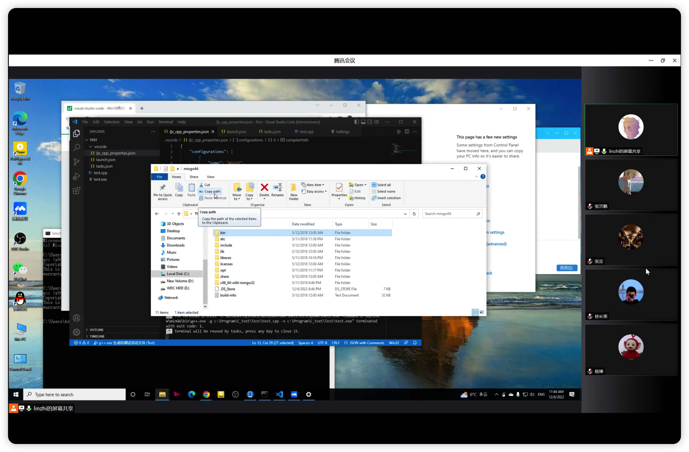
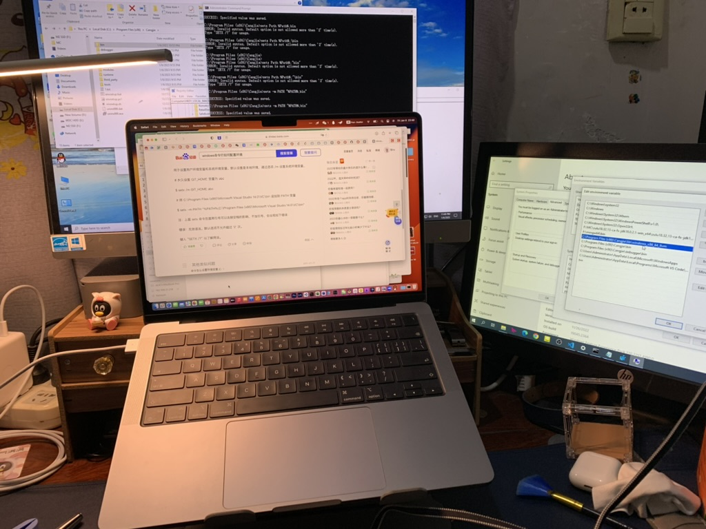
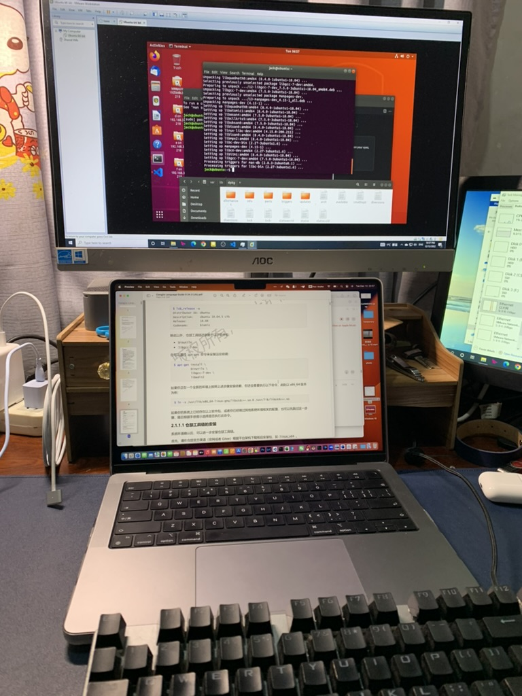
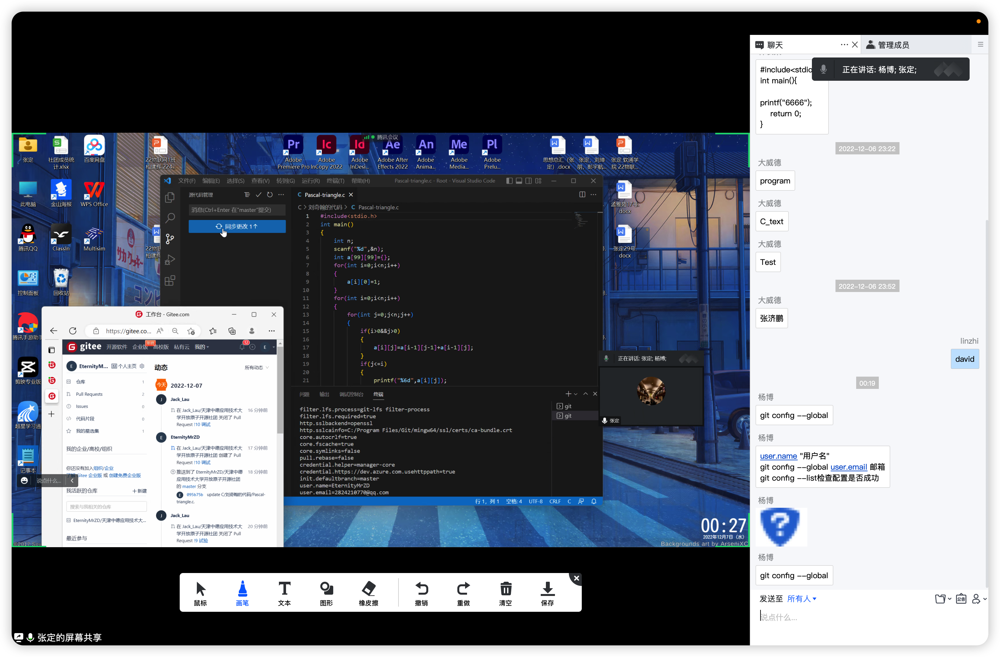
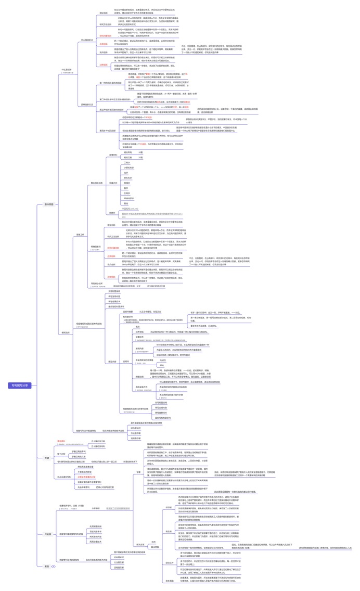

### 1.开源社团2022年年末活动
社长带领实任技术部部长组织了一次会议培训，邀请所有的社团成员参加。在会议中，他们向成员介VSCode 编辑器和 Gitee 命令的重要性以及如何应用它们来提高开发效率和团队协作。

在介绍 VSCode 配置之前，社长和部长向成员展示了 VSCode 编辑器的界面和基本功能。他们演示如何打开编辑器、创建新文件、打开项目文件夹等操作。还介绍一些常用的快捷键和编辑器布局调整技巧。

接下来，社长和部长分享一些常用的 VSCode 扩展和插件，这些插件可以增强编辑器的功能和适应不同编程语言的需求。他们向成员推荐一些常用的插件，如代码格式化工具、调试器、版本控制工具等，并演示如何安装和配置这些插件。

在介绍 Gitee 命令之前，社长和部长向成员解释 Git 和版本控制的概念。他们讲解什么是 Git、为什么使用 Git 进行版本控制以及如何利用 Git 来管理项目的代码。

社长和部长向成员展示一些常用的 Gitee 命令，并解释每个命令的作用和用法。他们演示如何克隆远程仓库、添加和提交更改、推送更改到远程仓库、拉取最新代码等操作。同时，他们还介绍一些常见的分支管理和合并操作。

在培训结束后，社长和部长提供一份参考文档或教程，供成员在日后自主学习和查阅。这份文档可以包含常用的 VSCode 快捷键、常用插件推荐、Git 命令的用法示例等内容，以帮助成员加深对这些工具的理解和运用。

