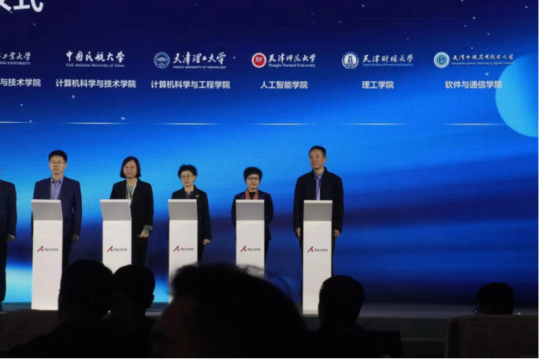
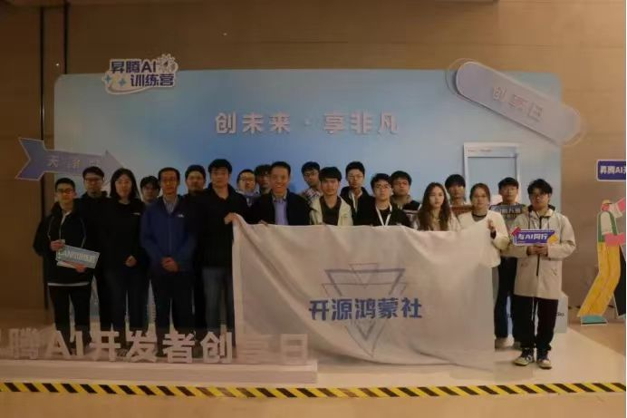
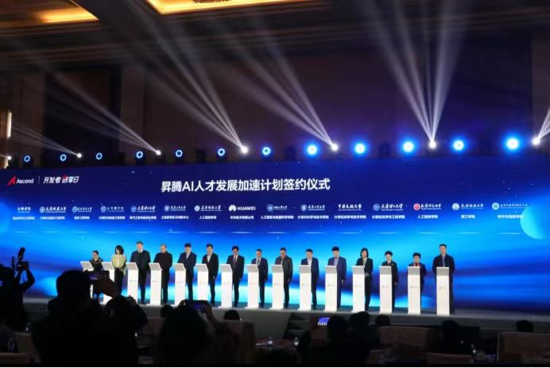
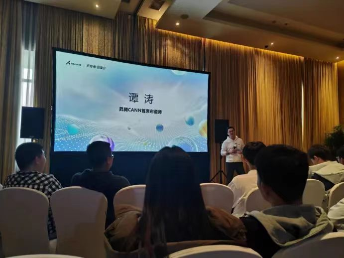
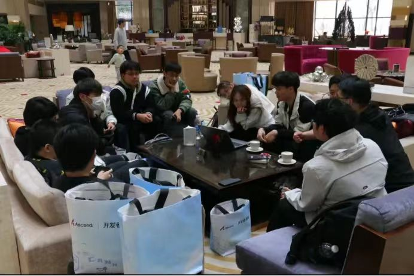

### 10.华为昇腾AI创享日·天津站
2024年3月23日，由天津市发展和改革委员会、天津市科学技术局、天津市工业和信息化局等单位指导，天津市河北区人民政府、华为技术有限公司主办，天津市人工智能计算中心承办的“2024昇腾AI开发者创享日·天津站”系列活动于天津万丽宾馆正式举办。软件与通信学院院长杨清永、物联网系专任教师应邀出席活动，带领开源鸿蒙社社团成员一同参加学习交流。

此次活动旨在通过“新技术，新体验，新机会”三个维度为师生普及和发展AI人工智能，为开发者创造新价值，不断丰富功能，稳步推进产教融合育人。业界顶尖AI专家应邀出席活动，分享前沿科技，解析技术要点。

为进一步深化天津高校人工智能人才培养产教融合改革，鼓励高校利用昇腾AI教学资源，加速人工智能学科建设和人才培养，天津12所高校的14个学院受邀进行现场昇腾AI人才发展加速计划签约仪式，其中，杨清永院长代表我院完成签约仪式。

下午，在昇腾AI训练营-开发新“势”力中，昇腾CANN首席席布师谭涛出席“脱口秀”讲座，以脱口秀的方式为业内人士、高校师生解疑答惑，传授开发经验。鸿蒙社社团跟随讲师的步伐，积极与讲师进行现场互动，更深入的了解和学习昇腾AI基础软件知识及应用能力。

日程结束后，开源鸿蒙社成员们对研学进行了回顾并总结。通过此次活动，同学们提高了对AI创新技术的认识，开辟了创新未来的新思路，为日后的AI学习之路打下良好基础。