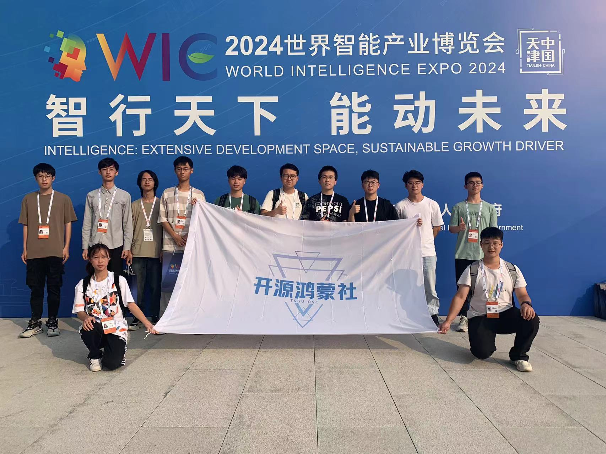

### 11.世界智能产业博览会

2024年6月20日，2024世界智能产业博览会盛大开幕，社长刘奇翰带领社团成员参加了此次盛会，深入参与了“ENAS 2024世界智能产业博览会人工智能赋能微电子产业创新技术交流对接活动”。本次活动以“智行天下，能动未来”为主题，聚焦人工智能如何推动微电子产业的创新发展，并邀请了来自欧盟、美国、德国等核心领域的顶级专家参与，共同探讨人工智能在微电子技术领域的应用，促进全球范围内的交流合作。

通过参会学习，同学们对人工智能的前沿应用有了新的了解，并且在与德国专家交流的过程中，学到了关于芯片设计和制造的前沿知识。活动结束后，他们与德国弗劳恩霍夫电子纳米系统研究所Dr. Harald Kuhn合影留念，记录下这次难忘的学习经历。

这次博览会的学习不仅为同学们带来了新的技术启发，还激励他们将开源技术与世界前沿科技相结合，努力在未来为智能产业的发展贡献力量。
