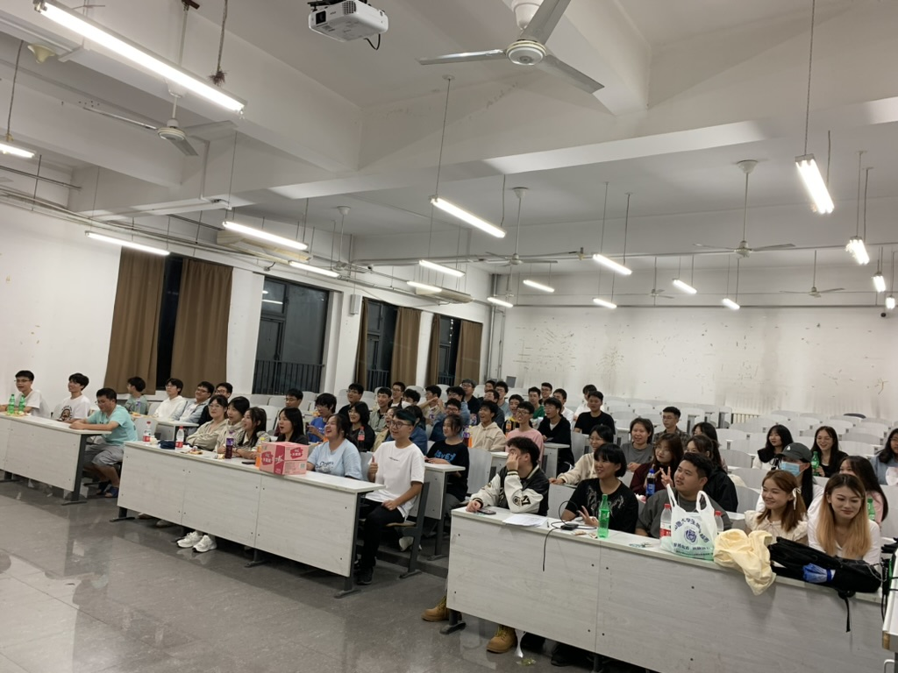
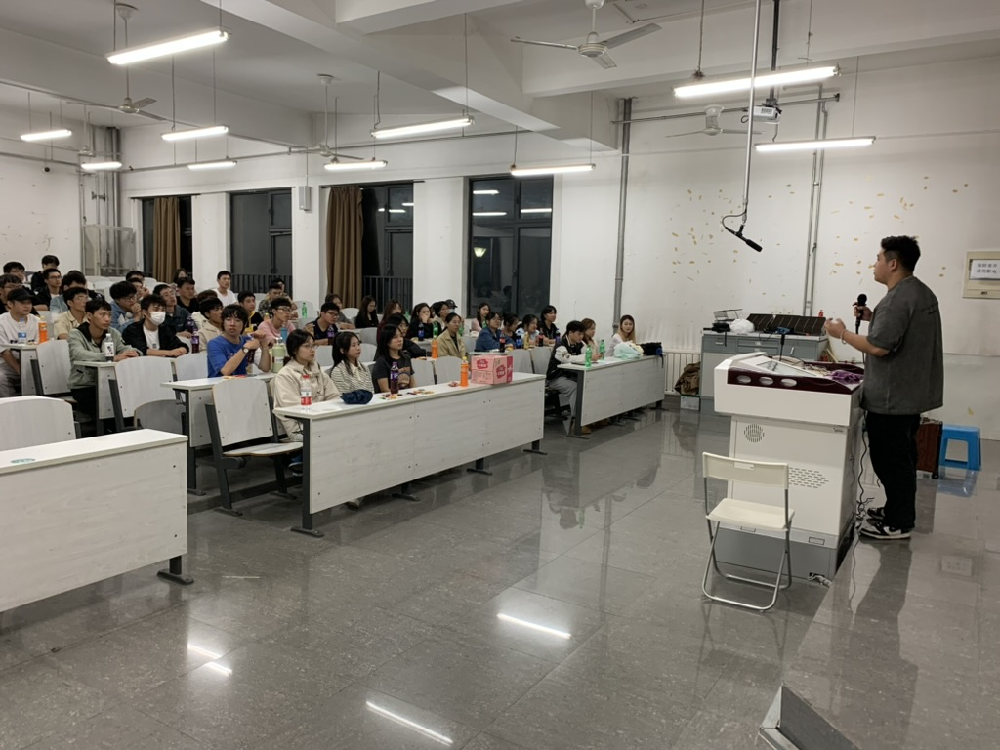
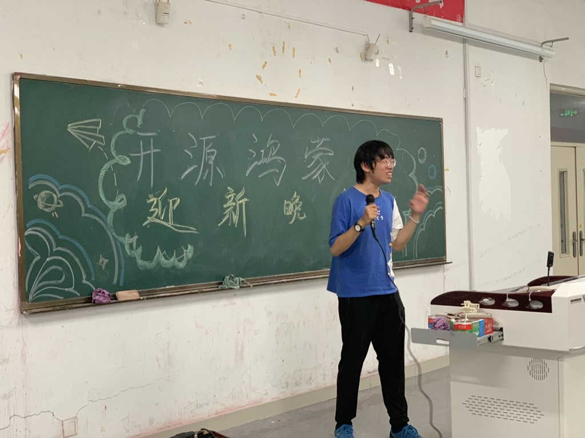
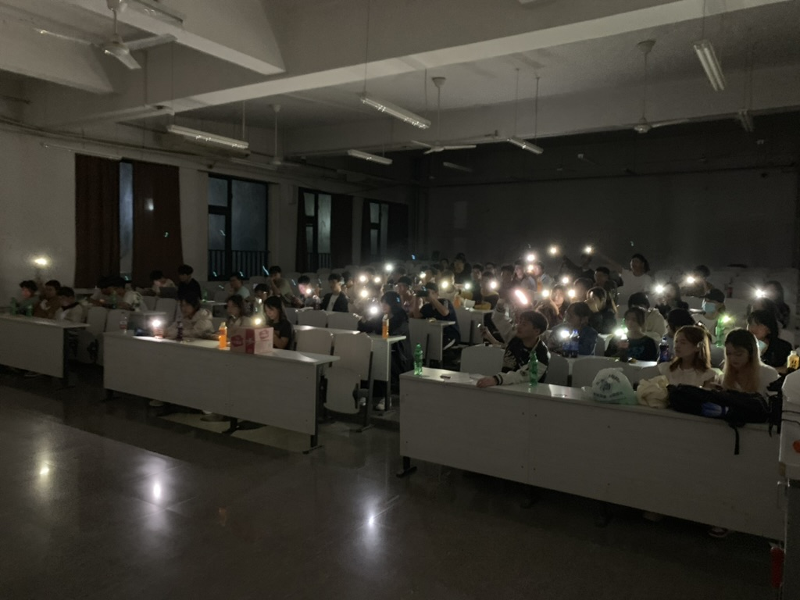
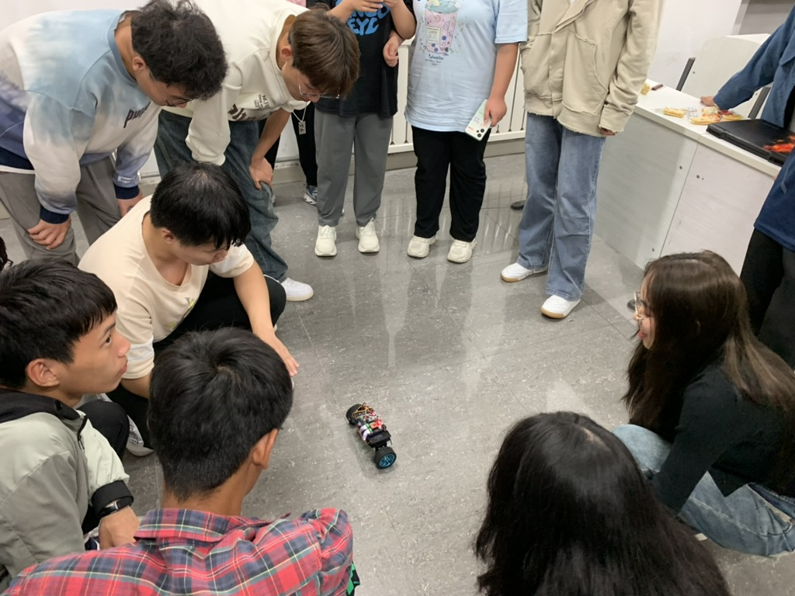
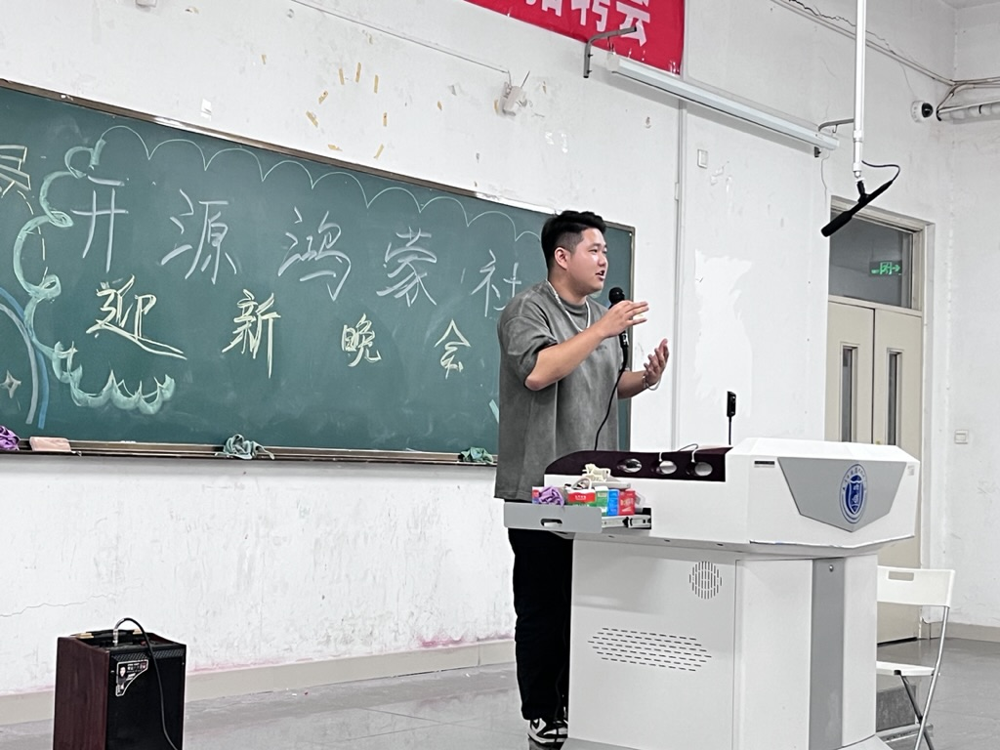

### 2.开源社团迎新晚会
2023年9月27号，开源社团组织了迎新晚会开源社团迎新晚会是一个欢迎新成员加入社团、营造友好交流氛围的重要活动。在这个活动中，社团成员齐聚一堂，共同庆祝新的起点和新的成员加入。

迎新晚会的氛围通常充满活力和热情。活动开始时，社团负责人或主持人会发表欢迎致辞，介绍开源社团的宗旨和理念，强调社团的价值和成就。此举旨在让新成员了解社团的使命和目标，同时激发他们对开源项目和社团活动的兴趣。

在自我介绍环节，每位新成员有机会向大家展示自己。他们可以介绍自己的姓名、专业背景、个人特长以及对开源社团的期望。这个环节有助于新老成员之间的相互了解和交流，促进团队的凝聚力和彼此的合作意识。

迎新晚会还会安排项目展示环节，让社团成员分享社团正在进行的开源项目。他们将介绍项目的背景、目标和最新进展，展示社团的实力和成果。这个环节不仅向新成员展示了社团的技术实力，也为他们提供了参与项目的机会和动力。

为了增加活动的趣味性和互动性，通常会组织一些互动游戏。这些游戏旨在促进新老成员之间的交流和合作，拉近彼此的距离。同时，一些小奖品和抽奖环节也会增加活动的乐趣，让每个参与者都有机会获得一些惊喜。

迎新晚会的总结和展望环节是活动的压轴部分。在这个环节中，主持人会回顾整个晚会的精彩瞬间，总结活动的成果和意义。同时，对社团的未来发展进行展望，鼓励成员继续参与和支持社团的活动和项目。

总的来说，开源社团举办的迎新晚会是一个充满活力和团结的盛会。通过活动，新老成员之间建立起联系和互信，为社团的发展奠定了坚实的基础。这个晚会不仅提供了一个展示社团实力和项目的平台，也为新成员融入社团，找到志同道合的伙伴提供了机会。
