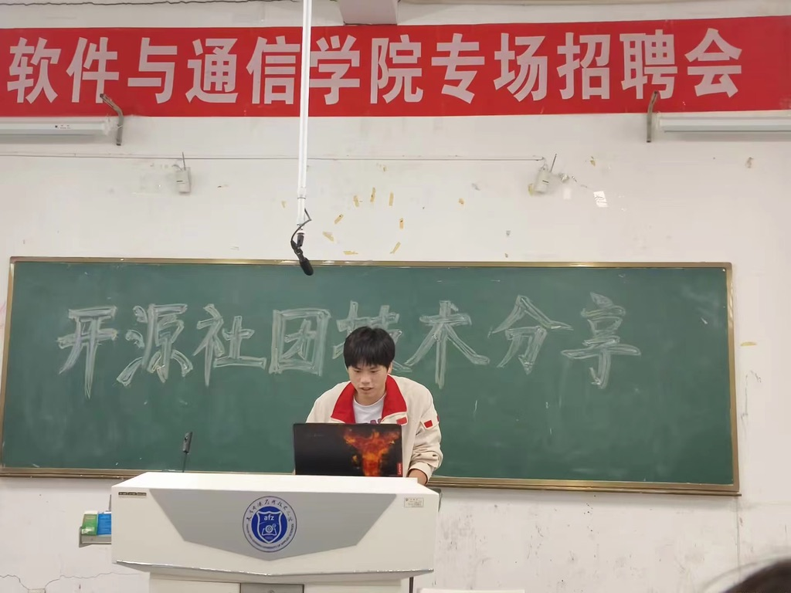
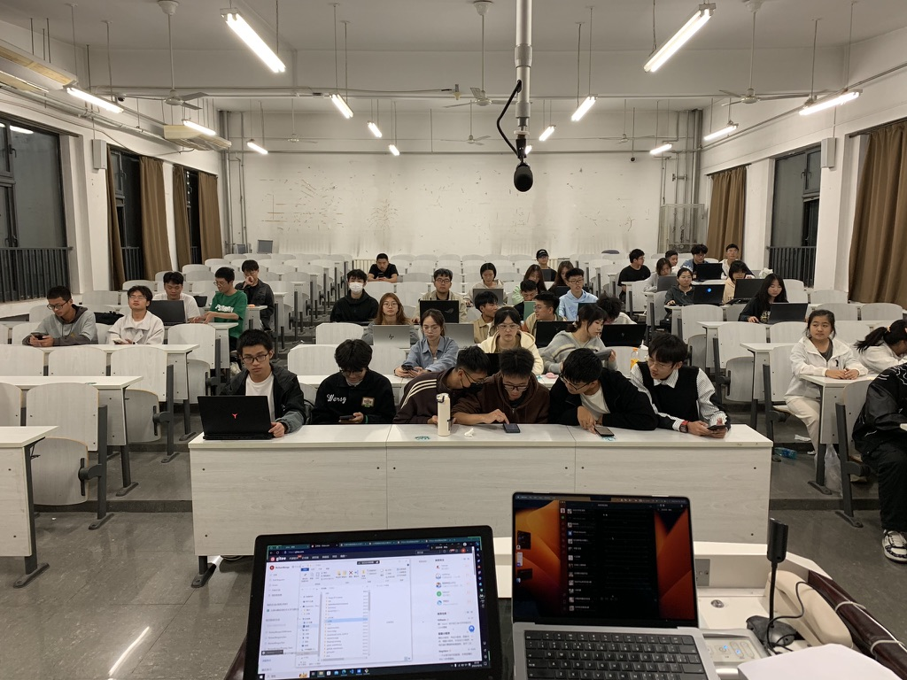
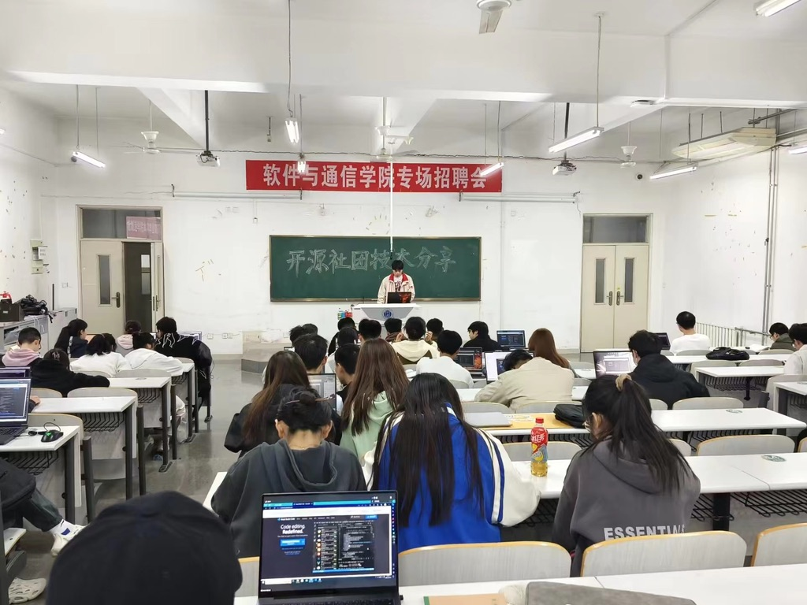
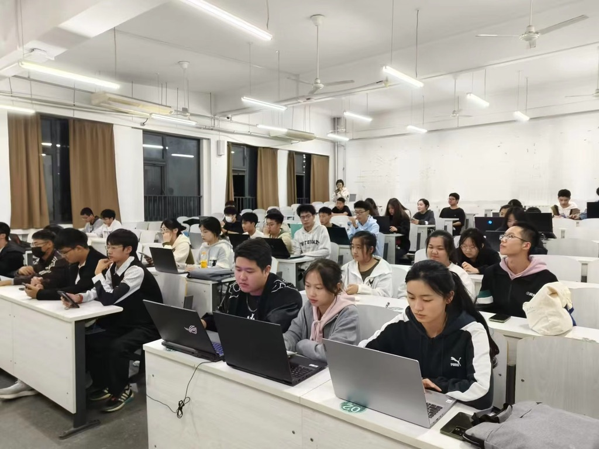

### 3.首次技术培训
开源社团举办首次技术培训是为了提升成员的技术能力和知识水平，以便更好地参与开源项目和贡献。以下是对开源社团首次技术培训的描述：

首次技术培训是开源社团为成员提供的一次重要学习机会。这次培训旨在帮助成员掌握特定的技术和工具，提高他们在开源项目中的参与度和贡献能力。

培训的内容通常根据社团成员的需求和兴趣进行选择，涵盖了各种与开源项目相关的技术主题。例如开源相关基础理念和VS Code的C/C++开发，调试环境配置，git的使用和gitee的简单介绍。培训内容的选择旨在满足成员在开源项目中实际应用的需求，并提供他们所需的实用技能。

除了理论知识的传授，技术培训通常也会包含实践环节。参与者将有机会在培训过程中进行实际的编码练习、项目演示或者模拟场景的操作，以加深对所学内容的理解和掌握。这些实践环节有助于参与者将所学知识应用到实际项目中，并培养他们的解决问题和协作能力。

开源社团首次技术培训为成员提供了一个良好的学习平台，帮助他们扩展技术视野、提升技能水平，并为将来参与开源项目做好准备。通过这次培训，成员们能够更加自信地面对技术挑战，为开源社区做出更有质量和影响力的贡献。