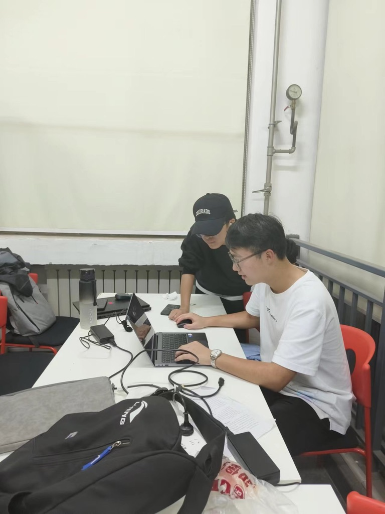
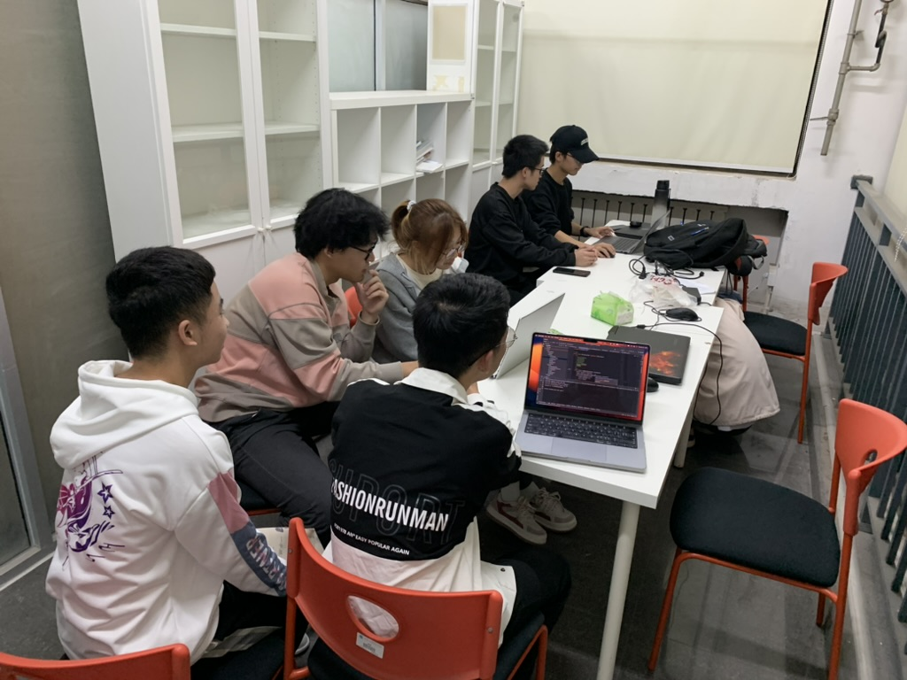

### 4.PR比赛
PR比赛是开源社团为成员提供的一项创新活动，旨在激发他们对开源项目的兴趣和参与度。这个比赛的主要目标是鼓励社团成员提交高质量的Pull Request，以改进和扩展开源项目的功能、修复漏洞或优化代码等。

在PR比赛开始之前，社团会事先确定一些适合贡献的开源项目或任务，并提供相应的文档和指导，以帮助成员理解项目的背景、目标和贡献方式。这些项目或任务可以涉及各种技术领域，如软件开发、数据分析、用户界面设计等，以满足不同成员的兴趣和技能。

比赛开始后，社团成员被鼓励在规定的时间内提交自己的Pull Request。他们根据自己的能力和兴趣选择了适合自己的项目或任务，并着手解决其中的问题或提出改进建议。

评选和奖励是PR比赛的重要环节。社团组织了一支评审团队，由经验丰富的社团代领人组成，对提交的Pull Request进行评估和比较。评审团考虑了贡献的创新性、实用性、代码质量以及对项目的影响等方面进行评分。最终，评选出一定数量的优秀贡献者，并颁发奖项或奖励，以表彰他们的努力和贡献。

PR比赛不仅鼓励社团成员积极参与开源项目的贡献，还促进了成员之间的交流和合作。在比赛过程中，成员们可以相互学习、分享经验，并共同解决问题。这种合作和团队精神对于开源社团的发展和项目的成功至关重要。

通过举办PR比赛，开源社团为成员提供了一个展示技能和贡献的平台，同时也为开源项目注入了新的活力和创新。这种活动促进了社团的成长和凝聚力，并为成员提供了实践和学习的宝贵机会。