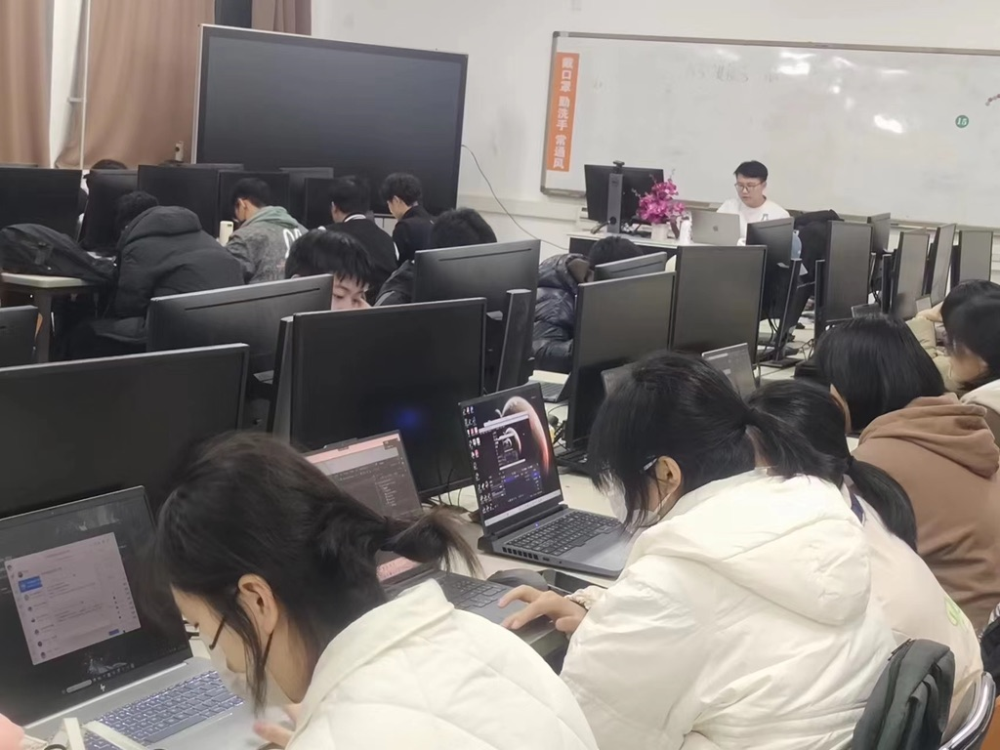
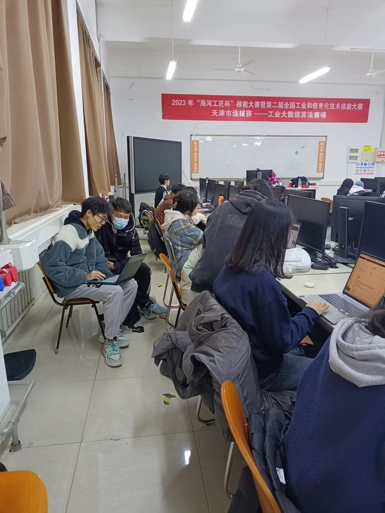

### 5.如何使用开源项目 
今天，在开源鸿蒙社团总部，我们举办了一次特殊的活动。社团的创始人兼社长刘奇翰亲自指导了30名社团成员学习如何使用Gitee，并且介绍了开源活动的重要性。这次活动的目的是让社团成员更好地了解开源项目的概念，提高他们的编程和协作能力。活动开始时，刘奇翰先向我们介绍了什么是Gitee。他解释了Gitee是一个基于Git的代码托管平台，可以用于版本控制、协作开发和项目管理。  

刘奇翰强调了在开源项目中使用Gitee的重要性，它可以帮助开发者更好地组织和跟踪代码的变更，以及促进团队成员之间的协作。随后，刘奇翰详细讲解了如何在Gitee上创建仓库、克隆项目、提交更改和合并请求等基本操作。    

他分享了一些最佳实践和技巧，以帮助社团成员更有效地利用Gitee进行项目管理和团队协作。在介绍完Gitee的基本操作后，刘奇翰引入了开源活动的概念。他解释了什么是开源，以及为什么开源对于软件开发和整个技术社区的重要性。他强调了通过开源项目，个人和团队可以贡献代码、解决问题，并与全球开发者社区分享知识和经验的机会。

为了让社团成员实践他们所学到的知识，刘奇翰提出了一个有趣的任务：编写一个简单的C语言五子棋项目。他提供了一些基本的要求和指导，包括游戏规则、棋盘表示和胜负判断等。此外，他鼓励社团成员在项目中展示他们的创造力和编码技巧。    

活动的最后，社团成员们分成小组，开始了他们的五子棋项目的编写。大家积极讨论、互相交流，并利用Gitee进行代码的共享和协作。刘奇翰和其他导师们也在一旁提供帮助和指导，确保每个人都能得到支持和鼓励。通过这次活动，社团成员们不仅学会了如何使用Gitee进行项目管理和团队协作，还理解了开源活动的重要性。   
 

他们将这次活动中学到的知识和经验应用于实际项目中，提高了他们的编程能力和团队协作能力。这次活动对于开源鸿蒙社团来说是一次极为有意义的经历，我们衷心感谢刘奇翰的指导和支持。通过这样的活动，我们相信社团成员们将在开源领域取得更多的成就，并为技术社区的发展作出自己的贡献。  