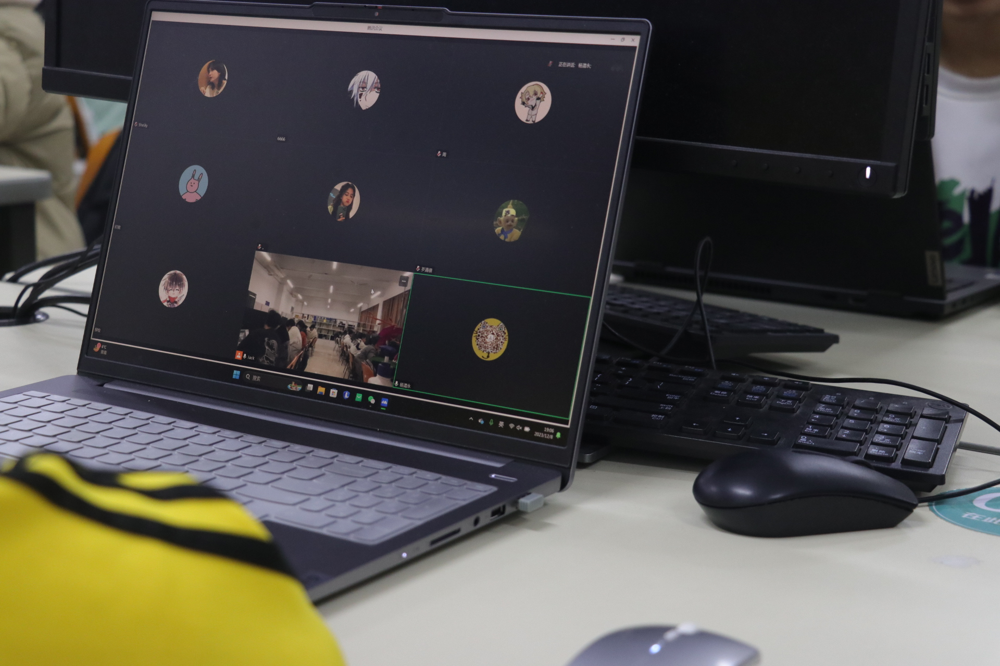
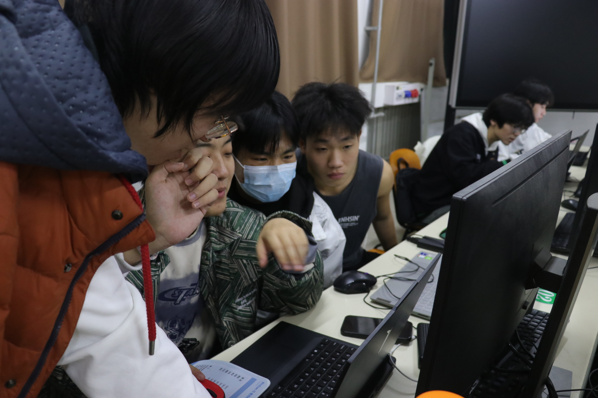
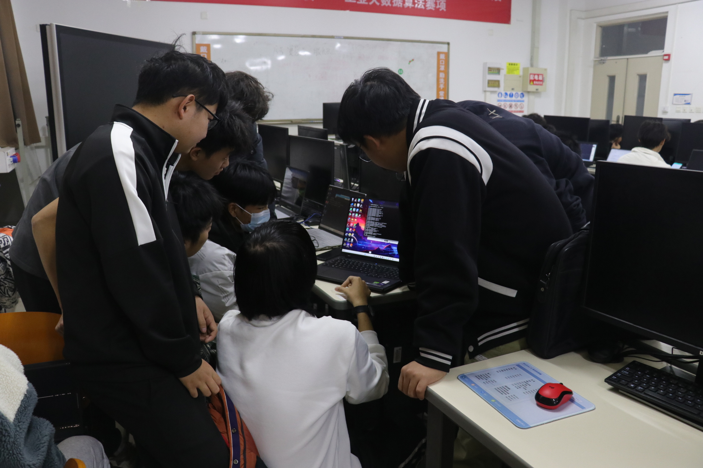

### 6.Linux入门培训
在F2 318教室里，开源鸿蒙社举行了Linux的入门培训。刘奇翰和柳检联手带领着社团学生学习如何有效利用服务器资源，这为开源项目的开发提供了强大的支持。活动开始之前，刘奇翰和柳检向学生们详细介绍了服务器资源的重要性以及如何高效利用这些资源。他们强调了服务器的作用和价值，以及如何通过合理规划和管理服务器资源来提高开发效率。

在上机实践过程中，社团成员分组实际操作服务器资源。他们根据项目需求，合理分配和利用服务器资源，确保项目的稳定运行和高效开发。刘奇翰和柳检时刻关注着每个小组的操作情况，为各小组提供有效指导。 

 

他们鼓励学生们尝试新的方法和技术，激发他们在实践中发挥创造力和解决问题的能力。通过实践操作，学生们逐渐掌握了有效利用服务器资源的技巧。他们学会了监测服务器性能、调整资源分配以及处理服务器故障等关键技能。  

刘奇翰和柳检对学生们的进步和成果感到非常满意，对他们在实践中展现的聪明才智和团队合作能力表示赞赏。这次开源鸿蒙社活动不仅提供了学习服务器资源管理的机会，还培养了学生们的协作能力和问题解决能力。刘奇翰和柳检的指导和支持起到了至关重要的作用。  

通过这次活动，学生们不仅扩展了自己的技术能力，还提高了他们在团队合作和项目管理方面的能力。这样的活动不仅仅是一次技术实践，更是推动学生创新思维和科技发展的重要途径。 

刘奇翰和柳检的引领和鼓励为学生们的成长和未来发展提供了有力的支持。相信通过这样的活动，学生们将更加熟练掌握服务器资源的管理技术，并在科技领域中展现出自己卓越的才华。