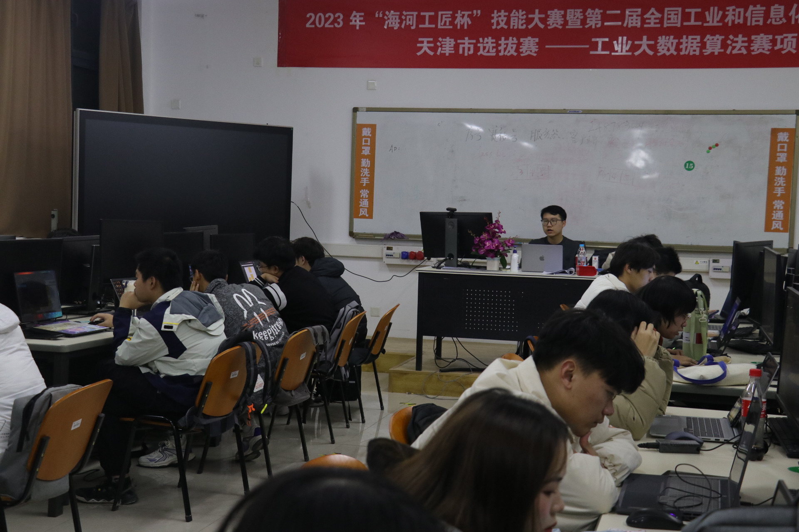
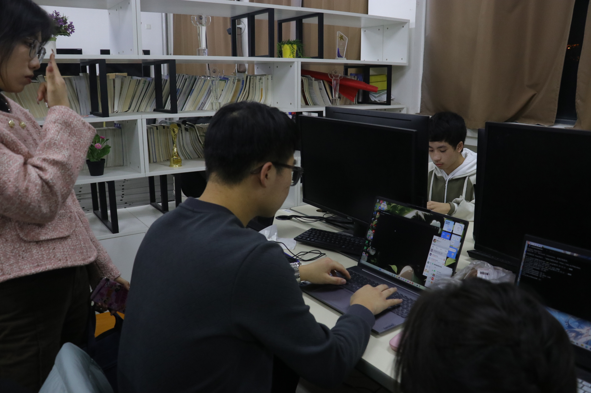

### 7.如何有效利用服务器资源
在F2 318教室里，一场备受期待的开源鸿蒙社活动正在进行中。刘奇翰学长和柳检学长亲自带领社团学生，为他们提供Linux入门培训，旨在帮助他们掌握这一重要的开源操作系统。而令大家感到荣幸的是，杨清永院长也通过线上视频为社团成员送上了祝词.活动开始之前，刘奇翰学长和柳检学长向学生们介绍了Linux操作系统的背景和优势。

他们解释了Linux的开源特性、稳定性和灵活性，并强调了它在技术领域的广泛应用。学生们对Linux的潜力产生了浓厚的兴趣，并迫不及待地期待着实践操作的环节。正当学生们准备开始上机实践时，大家收到了一条重要消息。杨清永院长通过线上视频向社团成员送上了祝词。  

他还强调了开源精神的重要性，希望学生们能够秉持开放、合作和共享的理念，为技术社区的繁荣贡献自己的智慧和热情.在杨院长的祝词激励下，学生们更加充满动力地投入到Linux入门培训中。

刘奇翰学长和柳检学长耐心指导学生们操作Linux系统，解答他们的问题，并分享自己的实践经验。学生们积极尝试各种命令和操作，通过实践加深对Linux的理解。刘奇翰学长和柳检学长在一旁提供实时的指导和建议，帮助学生们克服困难并取得进步通过这次Linux入门培训，学生们获得了宝贵的知识和技能。 

 

他们掌握了Linux操作系统的基本操作和常用命令，为以后更深入的学习打下了坚实的基础。刘奇翰学长和柳检学长对学生们的学习态度和成果表示赞赏，并鼓励他们在未来的项目中充分应用所学。  

这次开源鸿蒙社活动不仅提供了Linux入门培训的机会，还培养了学生们的学习能力和团队合作精神。刘奇翰学长和柳检学长的指导和支持起到了至关重要的作用。而杨清永院长的祝词更是为活动增添了鼓舞和动力，激励学生们在开源社区中继续探索和创新。