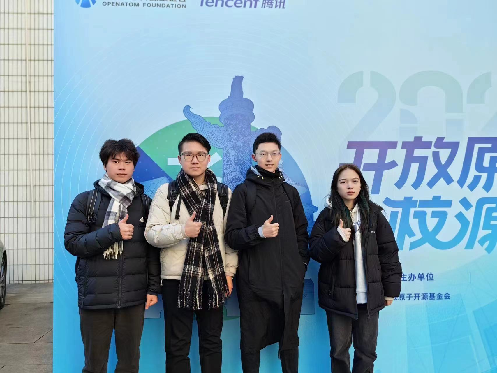
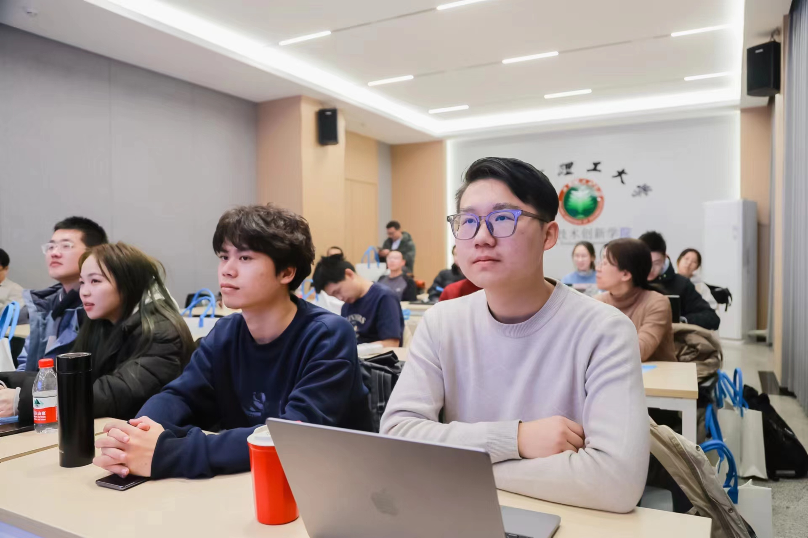
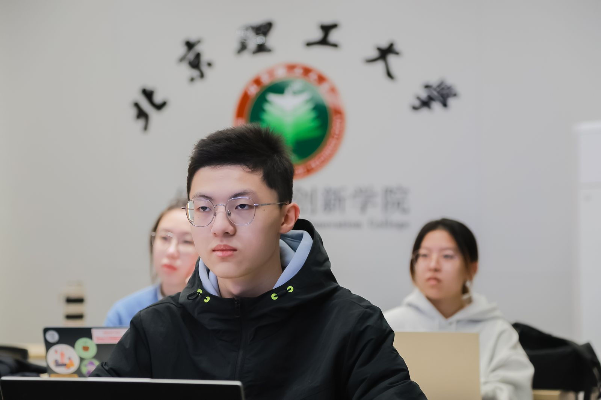
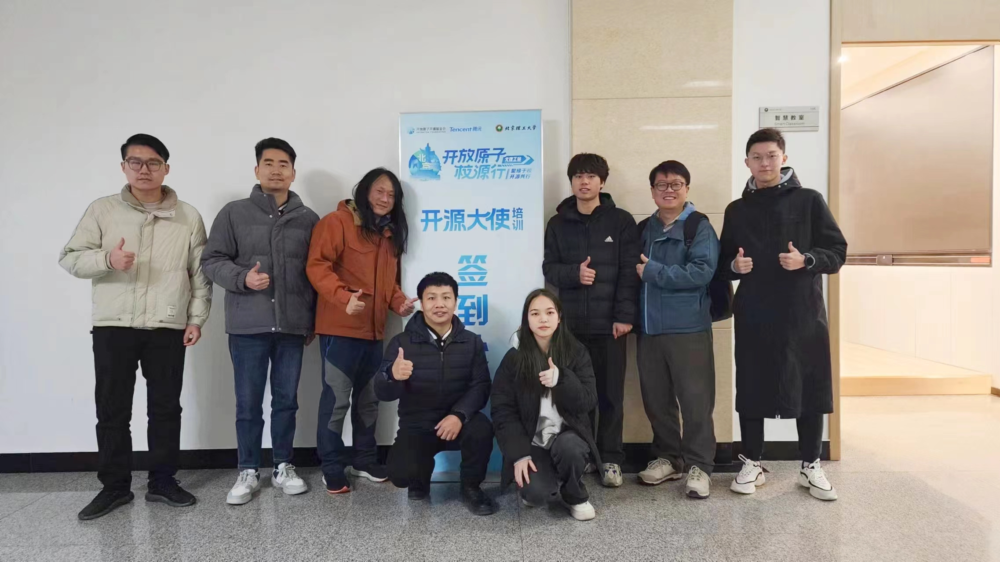

### 9.开放原子校源行(北理工站)
1月6日，由开放原子开源基金会主办，北京理工大学承办，深圳市腾讯计算机系统有限公司提供战略合作支持的开放原子校源行（北理工站）活动在北京理工大学成功举办。工业和信息化部信息技术发展司、人事教育司及人才交流中心相关领导，北京市经济和信息化局总工程师仝海威，开放原子开源基金会理事长孙文龙、秘书长冯冠霖，北京理工大学党委常委、副校长王博参加活动。北京理工大学计算机学院党委书记丁刚毅主持活动。

开放原子校源行公益项目旨在培育开源人才，推动我国开源生态繁荣发展，培养更多具有卓越创新能力的开源人才。我校开源鸿蒙社受邀参加此次活动，社长刘奇翰带领社团成员柳检，池思羽，刘曜语来到北京理工大学交流学习。

首先，北京理工大学吴长高，北京理工大学袁野，腾讯云数据库黄琳，开放原子开源基金会辛晓华，中软国际CTO卢戈，北京理工马锐，分别进行了主题分享。之后，北京大学荆琦，中科院软件所李梦，PingCAP陈小伟，开放原子开源基金会王岩广等嘉宾展开了一场圆桌会议。讨论了学生如何参与开源，学校和企业怎么看待开源等等问题。

下午2点，开源大使培训专场拉开帷幕。开放原子开源基金会资深顾问郭晧主持开展了开源大使培训课堂。

其中，郭老师分享了自己的经历，讲述了中国开源的40年的历程。社团成员全程认真听讲。郭老师告诉大家，现在大厂对开源人才的迫切需要，分析了开源在企业里的重要性。最后，基金会成员告诉了大家开放原子开源基金会未来的布局，以及招募开源大使的计划规划。

培训结束后，社团成员和郭老师以及开源大使们继续交流开源鸿蒙社的现状和发展计划，多方沟通了开放原子基金会和开源鸿蒙社的交流关系，鼓励开源鸿蒙社积极参加各类技术峰会，培养国际视野；支持我社培养社团人才，延续社团发展壮大；建议我社成员多参加竞赛，以赛促学；并且希望开源鸿蒙社同其他高校开源社团保持良好的交流关系。最后，我社成员和基金会讲师合影留念。

此次活动不但丰富了社团成员的生活，而且锻炼了社团成员的社交能力，开阔了社团成员的眼界。如今的就业环境，只有国际化视野的学子才能有更充分的竞争力，而本次活动便是难得的社交实践，我校开源鸿蒙社获得了不少企业和高校专业人士的肯定，也将得到更多学习与合作的机会，相信我校学子在我社学习会有更多的机遇！开源鸿蒙社热切期待我校师生的共同参与，一同感受开源技术的无限魅力。